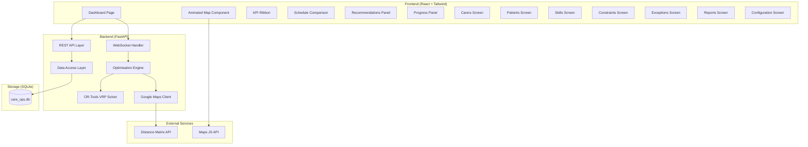

# Design Document: AI Care Operations Optimiser

## Overview

The AI Care Operations Optimiser is a full-stack prototype that augments domiciliary care rostering by computing optimal daily routes for carers and visually explaining the optimisation process through an animated map. The system operates on a single day's schedule for 5 carers and 20 visits, managed by one administrator without authentication.

The architecture follows a client-server pattern: a React + Tailwind CSS frontend communicates with a FastAPI backend via REST/WebSocket. The backend orchestrates Google OR-Tools for VRP solving, Google Maps APIs for travel data, and SQLite for persistence.

### Key Design Decisions

| Decision | Choice | Rationale |
|----------|--------|-----------|
| Solver | Google OR-Tools (Python) | Mature VRP solver, native Python bindings, handles time windows and capacities natively |
| Real-time updates | WebSocket | Progress feedback and animated step data require server-push semantics |
| Travel data | Google Distance Matrix API | Accurate real-world drive times, required for demo credibility |
| Storage | SQLite | Zero-config, single-file DB ideal for prototype; no multi-user concurrency |
| Map rendering | Google Maps JS API | Required for polyline routes, marker management, and animation |
| Frontend state | React Context + useReducer | Lightweight; no external state library needed for this scope |

## Architecture



### Communication Flow

```mermaid
sequenceDiagram
    participant Admin as Administrator
    participant FE as Frontend
    participant WS as WebSocket
    participant API as REST API
    participant Opt as Optimiser
    participant OR as OR-Tools
    participant GM as Google Maps API

    Admin->>FE: Click "Run Optimisation"
    FE->>WS: Connect /ws/optimise
    WS->>Opt: Start optimisation
    Opt->>API: Fetch carers, visits, patients
    API-->>Opt: Mock data
    Opt->>GM: Request travel time matrix
    GM-->>Opt: Distance matrix response
    Opt->>WS: Step 1 - Locations plotted
    WS-->>FE: Step event (locations)
    Opt->>WS: Step 2 - Matrix retrieved
    WS-->>FE: Step event (matrix info)
    Opt->>OR: Solve VRP with constraints
    Opt->>WS: Steps 3-6 (assignment, pruning, evaluation, improvement)
    WS-->>FE: Step events (progressive)
    OR-->>Opt: Solution
    Opt->>WS: Step 7 - Winning solution
    WS-->>FE: Step event (final routes)
    Opt->>WS: Step 8 - Animation data
    WS-->>FE: Step event (route animations)
    Opt->>API: Persist results
    FE->>Admin: Display results
```

### Deployment Topology

Single-machine deployment:
- **Frontend**: Vite dev server (port 5173) or static build served by FastAPI
- **Backend**: Uvicorn running FastAPI (port 8000)
- **Database**: SQLite file at `./data/care_ops.db`
- **Start**: Single `npm run start` script that launches both processes

## Components and Interfaces

### Frontend Components

#### Page Components

| Component | Route | Responsibility |
|-----------|-------|---------------|
| `DashboardPage` | `/` | Main view: KPI ribbon, animated map, schedule comparison, recommendations, progress |
| `CarersPage` | `/carers` | List and edit carer records |
| `PatientsPage` | `/patients` | List and edit patient records |
| `SkillsPage` | `/skills` | Manage care competencies |
| `ConstraintsPage` | `/constraints` | Enable/disable hard constraints |
| `ExceptionsPage` | `/exceptions` | View and resolve optimisation exceptions |
| `ReportsPage` | `/reports` | View summary statistics, print reports |
| `ScenariosPage` | `/scenarios` | Compare saved optimisation scenarios |
| `ConfigPage` | `/config` | Set Google Maps API key |

#### Dashboard Sub-Components

| Component | Props | Responsibility |
|-----------|-------|---------------|
| `KPIRibbon` | `metrics: KPIMetrics` | Display 6 KPI cards with labels and formatted values |
| `AnimatedMap` | `steps: AnimationStep[], isRunning: boolean` | Google Maps instance with step-by-step animation |
| `MapControls` | `onPause, onResume, currentStep` | Play/pause, step indicator |
| `ScheduleComparison` | `current: Schedule, proposed: Schedule` | Side-by-side route comparison with savings |
| `RecommendationsPanel` | `items: Recommendation[]` | Ordered list of recommendations and warnings |
| `ProgressPanel` | `step: number, stepName: string, score: number` | Real-time optimisation progress |
| `CompletionNotification` | `score: number, onDismiss` | Post-optimisation completion banner |

#### Shared Components

| Component | Responsibility |
|-----------|---------------|
| `NavSidebar` | Application navigation |
| `DataTable` | Reusable sortable table for CRUD screens |
| `EditModal` | Modal form for editing records |
| `ErrorBanner` | Display error messages |
| `ConfirmationToast` | Success/confirmation messages |
| `LoadingPlaceholder` | Skeleton/placeholder for loading states |

### Backend API Endpoints

#### REST Endpoints

| Method | Path | Request | Response | Purpose |
|--------|------|---------|----------|---------|
| GET | `/api/carers` | — | `Carer[]` | List all carers |
| PUT | `/api/carers/{id}` | `CarerUpdate` | `Carer` | Update carer |
| GET | `/api/patients` | — | `Patient[]` | List all patients |
| PUT | `/api/patients/{id}` | `PatientUpdate` | `Patient` | Update patient |
| GET | `/api/visits` | — | `Visit[]` | List all visits |
| DELETE | `/api/visits/{id}` | — | `204` | Cancel a visit (triggers re-optimisation) |
| GET | `/api/skills` | — | `Skill[]` | List skills with counts |
| POST | `/api/skills` | `SkillCreate` | `Skill` | Add new skill |
| GET | `/api/constraints` | — | `Constraint[]` | List constraints |
| PUT | `/api/constraints/{id}` | `ConstraintUpdate` | `Constraint` | Enable/disable constraint |
| GET | `/api/scenarios` | — | `ScenarioSummary[]` | List saved scenarios |
| POST | `/api/scenarios` | `ScenarioCreate` | `Scenario` | Save optimisation result |
| GET | `/api/scenarios/{id}` | — | `Scenario` | Get full scenario detail |
| GET | `/api/scenarios/compare` | `?ids=1,2` | `ScenarioComparison` | Compare two scenarios |
| GET | `/api/exceptions` | — | `Exception[]` | List exceptions |
| PUT | `/api/exceptions/{id}/resolve` | — | `Exception` | Mark exception resolved |
| GET | `/api/reports/latest` | — | `Report` | Latest optimisation report |
| GET | `/api/kpis` | — | `KPIMetrics` | Current KPI values |
| GET | `/api/config` | — | `Config` | Get config (API key status) |
| PUT | `/api/config` | `ConfigUpdate` | `Config` | Update config |

#### WebSocket Endpoint

| Path | Direction | Message Type | Payload |
|------|-----------|--------------|---------|
| `/ws/optimise` | Client→Server | `start` | `{ visitIds?: number[] }` |
| `/ws/optimise` | Server→Client | `step` | `AnimationStepPayload` |
| `/ws/optimise` | Server→Client | `progress` | `{ step: number, name: string, score: number }` |
| `/ws/optimise` | Server→Client | `complete` | `{ finalScore: number, routes: Route[] }` |
| `/ws/optimise` | Server→Client | `error` | `{ step: number, message: string }` |
| `/ws/optimise` | Client→Server | `pause` | `{}` |
| `/ws/optimise` | Client→Server | `resume` | `{}` |

### Optimisation Engine Interface

```python
class OptimisationEngine:
    async def run(
        self,
        carers: list[Carer],
        visits: list[Visit],
        patients: list[Patient],
        constraints: list[Constraint],
        travel_matrix: TravelTimeMatrix,
        on_step: Callable[[AnimationStep], Awaitable[None]],
        on_progress: Callable[[ProgressUpdate], Awaitable[None]],
    ) -> OptimisationResult:
        """Execute VRP optimisation with step-by-step callbacks."""
        ...

    def build_model(
        self,
        carers: list[Carer],
        visits: list[Visit],
        travel_matrix: TravelTimeMatrix,
        enabled_constraints: list[Constraint],
    ) -> RoutingModel:
        """Construct the OR-Tools routing model with constraints."""
        ...

    def extract_routes(self, solution: Assignment, model: RoutingModel) -> list[Route]:
        """Extract ordered route sequences from solved model."""
        ...
```

### Google Maps Client Interface

```python
class GoogleMapsClient:
    async def get_distance_matrix(
        self,
        origins: list[Location],
        destinations: list[Location],
        mode: str = "driving",
        timeout: float = 30.0,
    ) -> TravelTimeMatrix:
        """Fetch travel time/distance matrix from Distance Matrix API."""
        ...
```

## Data Models

### Database Schema (SQLite)

```sql
CREATE TABLE carers (
    id INTEGER PRIMARY KEY AUTOINCREMENT,
    name TEXT NOT NULL,
    home_lat REAL NOT NULL,
    home_lng REAL NOT NULL,
    skills TEXT NOT NULL,  -- JSON array of skill names
    max_working_hours REAL NOT NULL CHECK(max_working_hours >= 1 AND max_working_hours <= 24),
    max_continuous_hours REAL NOT NULL DEFAULT 6.0,
    min_break_minutes INTEGER NOT NULL DEFAULT 30,
    created_at TEXT NOT NULL DEFAULT (datetime('now')),
    updated_at TEXT NOT NULL DEFAULT (datetime('now'))
);

CREATE TABLE patients (
    id INTEGER PRIMARY KEY AUTOINCREMENT,
    name TEXT NOT NULL,
    address TEXT NOT NULL,
    lat REAL NOT NULL,
    lng REAL NOT NULL,
    preferences TEXT NOT NULL DEFAULT '[]',  -- JSON array
    priority TEXT NOT NULL CHECK(priority IN ('low', 'medium', 'high')),
    continuity_score REAL NOT NULL DEFAULT 0.0 CHECK(continuity_score >= 0 AND continuity_score <= 100),
    usual_carer_id INTEGER REFERENCES carers(id),
    preferred_carer_id INTEGER REFERENCES carers(id),
    created_at TEXT NOT NULL DEFAULT (datetime('now')),
    updated_at TEXT NOT NULL DEFAULT (datetime('now'))
);

CREATE TABLE visits (
    id INTEGER PRIMARY KEY AUTOINCREMENT,
    patient_id INTEGER NOT NULL REFERENCES patients(id),
    duration_minutes INTEGER NOT NULL CHECK(duration_minutes >= 15 AND duration_minutes <= 90),
    window_start TEXT NOT NULL,  -- HH:MM format
    window_end TEXT NOT NULL,    -- HH:MM format
    required_skills TEXT NOT NULL DEFAULT '[]',  -- JSON array of skill names
    preferred_time TEXT,  -- HH:MM format, nullable
    is_cancelled INTEGER NOT NULL DEFAULT 0,
    created_at TEXT NOT NULL DEFAULT (datetime('now')),
    updated_at TEXT NOT NULL DEFAULT (datetime('now'))
);

CREATE TABLE skills (
    id INTEGER PRIMARY KEY AUTOINCREMENT,
    name TEXT NOT NULL UNIQUE,
    created_at TEXT NOT NULL DEFAULT (datetime('now'))
);

CREATE TABLE constraints (
    id INTEGER PRIMARY KEY AUTOINCREMENT,
    name TEXT NOT NULL UNIQUE,
    description TEXT NOT NULL,
    is_enabled INTEGER NOT NULL DEFAULT 1,
    created_at TEXT NOT NULL DEFAULT (datetime('now')),
    updated_at TEXT NOT NULL DEFAULT (datetime('now'))
);

CREATE TABLE scenarios (
    id INTEGER PRIMARY KEY AUTOINCREMENT,
    name TEXT NOT NULL UNIQUE CHECK(length(name) >= 1 AND length(name) <= 100),
    total_travel_hours REAL NOT NULL,
    total_mileage REAL NOT NULL,
    total_overtime_hours REAL NOT NULL,
    continuity_score REAL NOT NULL,
    objective_score REAL NOT NULL,
    assignments TEXT NOT NULL,  -- JSON: [{visit_id, carer_id, start_time, travel_time, mileage}]
    routes TEXT NOT NULL,       -- JSON: full route data per carer
    created_at TEXT NOT NULL DEFAULT (datetime('now'))
);

CREATE TABLE exceptions (
    id INTEGER PRIMARY KEY AUTOINCREMENT,
    timestamp TEXT NOT NULL DEFAULT (datetime('now')),
    description TEXT NOT NULL,
    constraint_names TEXT NOT NULL,  -- JSON array
    affected_entity_type TEXT NOT NULL CHECK(affected_entity_type IN ('carer', 'visit')),
    affected_entity_id INTEGER NOT NULL,
    is_resolved INTEGER NOT NULL DEFAULT 0,
    resolved_at TEXT
);

CREATE TABLE config (
    key TEXT PRIMARY KEY,
    value TEXT NOT NULL
);
```

### TypeScript Models (Frontend)

```typescript
interface Carer {
  id: number;
  name: string;
  homeLat: number;
  homeLng: number;
  skills: string[];
  maxWorkingHours: number;
  maxContinuousHours: number;
  minBreakMinutes: number;
}

interface Patient {
  id: number;
  name: string;
  address: string;
  lat: number;
  lng: number;
  preferences: string[];
  priority: 'low' | 'medium' | 'high';
  continuityScore: number;
  usualCarerId: number | null;
  preferredCarerId: number | null;
}

interface Visit {
  id: number;
  patientId: number;
  durationMinutes: number;
  windowStart: string; // HH:MM
  windowEnd: string;   // HH:MM
  requiredSkills: string[];
  preferredTime: string | null; // HH:MM
  isCancelled: boolean;
}

interface KPIMetrics {
  totalVisits: number;
  carersAvailable: number;
  travelHours: number;   // 1 decimal place
  mileage: number;       // 1 decimal place
  overtime: number;      // 1 decimal place
  continuityScore: number; // 0-100 percentage
}

interface Route {
  carerId: number;
  stops: RouteStop[];
  totalTravelMinutes: number;
  totalMileage: number;
  totalCost: number;
}

interface RouteStop {
  visitId: number;
  patientId: number;
  arrivalTime: string;  // HH:MM
  startTime: string;    // HH:MM
  endTime: string;      // HH:MM
  travelTimeFromPrev: number; // minutes
  mileageFromPrev: number;
}

interface AnimationStep {
  stepNumber: number; // 1-8
  stepName: string;
  data: StepData; // Union type depending on step
}

type StepData =
  | { type: 'locations'; carers: MarkerData[]; patients: MarkerData[] }
  | { type: 'matrix'; pairCount: number }
  | { type: 'assignments'; edges: AssignmentEdge[] }
  | { type: 'pruning'; removedEdges: AssignmentEdge[]; reason: string }
  | { type: 'evaluation'; candidateRoutes: CandidateRoute[] }
  | { type: 'improvement'; iterations: { score: number }[] }
  | { type: 'solution'; routes: Route[]; finalScore: number }
  | { type: 'animation'; routes: RouteAnimation[] };

interface Recommendation {
  id: number;
  type: 'recommendation' | 'warning';
  title: string;
  description: string; // max 200 chars
  impact: number; // for ordering
}

interface Scenario {
  id: number;
  name: string;
  totalTravelHours: number;
  totalMileage: number;
  totalOvertimeHours: number;
  continuityScore: number;
  objectiveScore: number;
  assignments: VisitAssignment[];
  routes: Route[];
  createdAt: string;
}

interface Exception {
  id: number;
  timestamp: string;
  description: string;
  constraintNames: string[];
  affectedEntityType: 'carer' | 'visit';
  affectedEntityId: number;
  isResolved: boolean;
  resolvedAt: string | null;
}
```

### Python Models (Backend - Pydantic)

```python
from pydantic import BaseModel, Field
from typing import Optional
from enum import Enum

class Priority(str, Enum):
    LOW = "low"
    MEDIUM = "medium"
    HIGH = "high"

class CarerModel(BaseModel):
    id: int
    name: str
    home_lat: float
    home_lng: float
    skills: list[str]
    max_working_hours: float = Field(ge=1, le=24)
    max_continuous_hours: float = Field(default=6.0)
    min_break_minutes: int = Field(default=30)

class CarerUpdate(BaseModel):
    name: Optional[str] = None
    home_lat: Optional[float] = None
    home_lng: Optional[float] = None
    skills: Optional[list[str]] = None
    max_working_hours: Optional[float] = Field(default=None, ge=1, le=24)
    max_continuous_hours: Optional[float] = None
    min_break_minutes: Optional[int] = None

class PatientModel(BaseModel):
    id: int
    name: str
    address: str
    lat: float
    lng: float
    preferences: list[str]
    priority: Priority
    continuity_score: float = Field(ge=0, le=100)
    usual_carer_id: Optional[int] = None
    preferred_carer_id: Optional[int] = None

class PatientUpdate(BaseModel):
    name: Optional[str] = None
    address: Optional[str] = None
    lat: Optional[float] = None
    lng: Optional[float] = None
    preferences: Optional[list[str]] = None
    priority: Optional[Priority] = None
    usual_carer_id: Optional[int] = None
    preferred_carer_id: Optional[int] = None

class VisitModel(BaseModel):
    id: int
    patient_id: int
    duration_minutes: int = Field(ge=15, le=90)
    window_start: str  # HH:MM
    window_end: str    # HH:MM
    required_skills: list[str]
    preferred_time: Optional[str] = None
    is_cancelled: bool = False

class SkillModel(BaseModel):
    id: int
    name: str

class SkillCreate(BaseModel):
    name: str = Field(min_length=1, max_length=100)

class ConstraintModel(BaseModel):
    id: int
    name: str
    description: str
    is_enabled: bool

class ConstraintUpdate(BaseModel):
    is_enabled: bool

class TravelTimeMatrix(BaseModel):
    """Matrix indexed by location pairs."""
    locations: list[tuple[float, float]]  # (lat, lng) ordered list
    durations: list[list[int]]  # seconds between location[i] and location[j]
    distances: list[list[int]]  # metres between location[i] and location[j]

class RouteStop(BaseModel):
    visit_id: int
    patient_id: int
    arrival_time: str
    start_time: str
    end_time: str
    travel_time_from_prev: int  # minutes
    mileage_from_prev: float

class RouteModel(BaseModel):
    carer_id: int
    stops: list[RouteStop]
    total_travel_minutes: int
    total_mileage: float
    total_cost: float

class OptimisationResult(BaseModel):
    routes: list[RouteModel]
    objective_score: float
    kpis: "KPIMetrics"
    recommendations: list["RecommendationModel"]
    unassigned_visits: list[int]
    infeasibility_reasons: list["InfeasibilityReason"]

class InfeasibilityReason(BaseModel):
    visit_id: int
    carer_ids: list[int]
    constraint_name: str
    reason: str

class KPIMetrics(BaseModel):
    total_visits: int
    carers_available: int
    travel_hours: float
    mileage: float
    overtime: float
    continuity_score: float

class RecommendationModel(BaseModel):
    type: str  # "recommendation" | "warning"
    title: str
    description: str = Field(max_length=200)
    impact: float

class ScenarioCreate(BaseModel):
    name: str = Field(min_length=1, max_length=100)

class ScenarioModel(BaseModel):
    id: int
    name: str
    total_travel_hours: float
    total_mileage: float
    total_overtime_hours: float
    continuity_score: float
    objective_score: float
    assignments: list[dict]
    routes: list[RouteModel]
    created_at: str

class ExceptionModel(BaseModel):
    id: int
    timestamp: str
    description: str
    constraint_names: list[str]
    affected_entity_type: str
    affected_entity_id: int
    is_resolved: bool
    resolved_at: Optional[str] = None
```

## Correctness Properties

*A property is a characteristic or behavior that should hold true across all valid executions of a system — essentially, a formal statement about what the system should do. Properties serve as the bridge between human-readable specifications and machine-verifiable correctness guarantees.*

### Property 1: KPI Formatting Invariant

*For any* valid KPIMetrics object, formatting the metrics for display SHALL produce integer metrics (Total Visits, Carers Available) as whole numbers with no decimal places, and decimal metrics (Travel Hours, Mileage, Overtime) with exactly one decimal place, and Continuity Score as an integer percentage (0–100).

**Validates: Requirements 1.3**

### Property 2: Objective Function Calculation

*For any* valid set of routes with computed travel times, mileage, overtime, continuity scores, preference satisfaction, workload balance, and punctuality values, the objective function SHALL equal the weighted sum: `w1*travel_time + w2*mileage + w3*overtime - w4*continuity - w5*preference - w6*balance - w7*punctuality` where weights are the configured coefficients.

**Validates: Requirements 3.4**

### Property 3: Optimiser Solution Quality

*For any* valid input set (carers, visits, constraints, travel matrix) where a feasible solution exists, the optimiser's output objective score SHALL be less than or equal to the baseline (unoptimised) schedule's objective score.

**Validates: Requirements 3.1**

### Property 4: Skill Matching Constraint

*For any* solution produced by the optimiser, every visit-to-carer assignment SHALL satisfy: the carer's skill set is a superset of the visit's required skills set (including medication competency when required).

**Validates: Requirements 4.1, 4.2**

### Property 5: Time Window Constraint

*For any* solution produced by the optimiser, every assigned visit SHALL have a scheduled start time >= window_start AND scheduled end time (start + duration) <= window_end.

**Validates: Requirements 4.3, 4.6**

### Property 6: Maximum Working Hours Constraint

*For any* solution produced by the optimiser, the total scheduled time for each carer (sum of visit durations + sum of travel times between consecutive visits) SHALL NOT exceed that carer's max_working_hours.

**Validates: Requirements 4.4**

### Property 7: Mandatory Break Constraint

*For any* solution produced by the optimiser, no carer SHALL have a continuous working stretch (visits + travel without a gap >= min_break_minutes) that exceeds their max_continuous_hours.

**Validates: Requirements 4.5**

### Property 8: No Overlapping Visits Constraint

*For any* solution produced by the optimiser and for any single carer, no two assigned visits SHALL have time intervals [start_time, start_time + duration] that overlap.

**Validates: Requirements 4.7**

### Property 9: Route Output Completeness

*For any* successful optimisation result, every route SHALL contain: a valid carer_id, a non-empty ordered list of stops where each stop has visit_id, arrival_time, start_time, end_time, travel_time_from_prev, and mileage_from_prev, and the stops SHALL be ordered chronologically by start_time.

**Validates: Requirements 3.5**

### Property 10: Infeasibility Detection

*For any* input set where one or more visits cannot be feasibly assigned while satisfying all enabled hard constraints, the optimiser SHALL include those visits in the unassigned_visits list with corresponding infeasibility_reasons identifying the conflicting constraint and affected entities.

**Validates: Requirements 3.6, 4.8**

### Property 11: Savings Calculation Correctness

*For any* two schedule metric sets (current and proposed), the computed savings SHALL equal current_value - proposed_value for each metric, and the percentage reduction SHALL equal ((current - proposed) / current) * 100 when current > 0.

**Validates: Requirements 5.2, 5.4**

### Property 12: Assignment Diff Detection

*For any* two sets of visit-to-carer assignments, the diff function SHALL return exactly the set of visit_ids where the assigned carer_id differs between the two sets.

**Validates: Requirements 5.3, 10.4**

### Property 13: Recommendations Ordering

*For any* list of generated recommendations, the displayed order SHALL be sorted by impact value in descending order (highest impact first), and the list SHALL contain at most 10 items.

**Validates: Requirements 9.1**

### Property 14: Carer Hours Warning Generation

*For any* carer in a completed optimisation result, a warning SHALL be generated if and only if the carer's total scheduled hours >= 0.8 * max_working_hours.

**Validates: Requirements 9.2**

### Property 15: Visit Window Edge Warning Generation

*For any* visit in a completed optimisation result, a warning SHALL be generated if the visit's scheduled start time is within 15 minutes of either edge of its time window (within 15 min of window_start or the visit ends within 15 min of window_end).

**Validates: Requirements 9.3**

### Property 16: Name Validation

*For any* string submitted as a scenario name or skill name, the system SHALL accept it if and only if its trimmed length is between 1 and 100 characters inclusive AND no existing record has the same name (case-sensitive).

**Validates: Requirements 10.1, 10.2, 12.5, 12.6**

### Property 17: Entity Edit Validation

*For any* carer update payload, the system SHALL reject the update if max_working_hours is outside [1, 24], or any required field (name) is empty. For any patient update, the system SHALL reject if priority is not in {low, medium, high} or any required field is empty. All other valid payloads SHALL be accepted.

**Validates: Requirements 11.4**

### Property 18: Skill Usage Count

*For any* set of carers and visits in the data store, the skill count displayed for each skill SHALL equal the number of carers whose skills list contains that skill name plus the number of visits whose required_skills list contains that skill name.

**Validates: Requirements 12.1**

### Property 19: Disabled Constraint Exclusion

*For any* optimisation run where a hard constraint is disabled, the optimiser MAY produce solutions that violate that specific constraint while still enforcing all other enabled constraints.

**Validates: Requirements 12.3, 12.4**

### Property 20: Exception Ordering

*For any* list of logged exceptions, the exceptions screen SHALL display them in descending order by timestamp (most recent first).

**Validates: Requirements 13.2**

## Error Handling

### Error Categories

| Category | Source | Handling Strategy |
|----------|--------|-------------------|
| API Key Missing | Configuration | Block optimisation, show config prompt |
| Google Maps API Failure | External service | Abort optimisation, display error with step context |
| Distance Matrix Partial Failure | External service | Abort optimisation, identify unresolved pairs |
| Optimisation Timeout | OR-Tools solver | Return best solution found so far, or abort if none |
| Infeasible Solution | Constraint conflict | Return partial solution + infeasibility explanation |
| WebSocket Disconnect | Network | Auto-reconnect with exponential backoff (3 attempts) |
| Validation Failure | User input | Reject with field-level error messages |
| Database Error | SQLite | Return 500 with generic message, log details |

### Error Response Format

```python
class ErrorResponse(BaseModel):
    error: str           # Machine-readable error code
    message: str         # Human-readable description
    details: dict | None # Additional context (affected entities, step number, etc.)
```

### Frontend Error Handling

- **Global error boundary**: Catches unhandled React errors, shows recovery UI
- **API error interceptor**: Axios interceptor formats backend errors into user-facing toasts
- **WebSocket error**: On disconnect during optimisation, show "Connection lost" banner with retry button
- **Map errors**: Google Maps load failure shows fallback message with API key check prompt

### Backend Error Handling

- **FastAPI exception handlers**: Registered for `ValidationError`, `HTTPException`, custom `OptimisationError`
- **Structured logging**: All errors logged with timestamp, request context, and stack trace
- **Graceful degradation**: Partial failures (e.g., one infeasible visit) don't crash the whole run

## Testing Strategy

### Testing Pyramid

```
        ┌──────────┐
        │   E2E    │  ← 2-3 critical paths (Cypress/Playwright)
       ─┼──────────┼─
       │ Integration │  ← API + WebSocket + DB (pytest + httpx)
      ─┼────────────┼─
     │  Property Tests │  ← Constraint logic, calculations (Hypothesis)
    ─┼──────────────────┼─
   │     Unit Tests       │  ← Formatters, validators, pure functions (pytest + Vitest)
  ─┼──────────────────────┼─
```

### Property-Based Testing (Hypothesis - Python)

The optimisation engine's constraint logic and calculation functions are ideal for property-based testing. We use [Hypothesis](https://hypothesis.readthedocs.io/) for Python.

**Configuration:**
- Minimum 100 examples per property test
- Each test tagged with: `# Feature: ai-care-operations-optimiser, Property {N}: {title}`
- Custom strategies for generating valid Carer, Visit, Patient, and TravelTimeMatrix instances

**Properties to implement:**
- Properties 2-10: Optimiser constraint and output properties (backend)
- Properties 11-12: Calculation and diff functions (backend + frontend)
- Properties 13-15: Recommendation/warning generation (backend)
- Properties 16-17: Validation logic (backend)
- Properties 18-20: Data query and ordering (backend)
- Property 1: KPI formatting (frontend, Vitest + fast-check)

### Unit Testing

**Backend (pytest):**
- Objective function weight calculations with specific examples
- Time parsing/formatting utilities
- Database query functions
- API endpoint response shapes

**Frontend (Vitest):**
- Component rendering (React Testing Library)
- KPI formatting functions
- Schedule comparison display logic
- Form validation

### Integration Testing

**Backend (pytest + httpx):**
- Full API endpoint flows (CRUD operations)
- WebSocket optimisation flow with mock Google Maps
- Database initialisation and migration
- Constraint enable/disable affecting optimiser behavior

**Frontend (Vitest + MSW):**
- API integration with mocked backend
- WebSocket message handling
- State management flows

### End-to-End Testing (Playwright)

- Complete optimisation run flow: trigger → animate → view results
- Visit cancellation and re-optimisation
- Scenario save and comparison
- Carer/Patient edit and optimisation with edited data

### Test Data Generation Strategies (Hypothesis)

```python
from hypothesis import strategies as st

# Generate valid time strings (HH:MM)
time_str = st.builds(
    lambda h, m: f"{h:02d}:{m:02d}",
    st.integers(min_value=6, max_value=20),
    st.integers(min_value=0, max_value=59)
)

# Generate valid carer
carer_strategy = st.builds(
    Carer,
    id=st.integers(min_value=1),
    name=st.text(min_size=1, max_size=50),
    home_lat=st.floats(min_value=50.0, max_value=55.0),
    home_lng=st.floats(min_value=-3.0, max_value=1.0),
    skills=st.lists(st.sampled_from(SKILL_POOL), min_size=2, max_size=5, unique=True),
    max_working_hours=st.floats(min_value=6.0, max_value=10.0),
    max_continuous_hours=st.floats(min_value=4.0, max_value=6.0),
    min_break_minutes=st.integers(min_value=20, max_value=45),
)

# Generate valid visit with consistent time window
visit_strategy = st.builds(
    make_valid_visit,  # factory ensuring window_end >= window_start + duration
    duration=st.integers(min_value=15, max_value=90),
    required_skills=st.lists(st.sampled_from(SKILL_POOL), min_size=1, max_size=3, unique=True),
)
```

