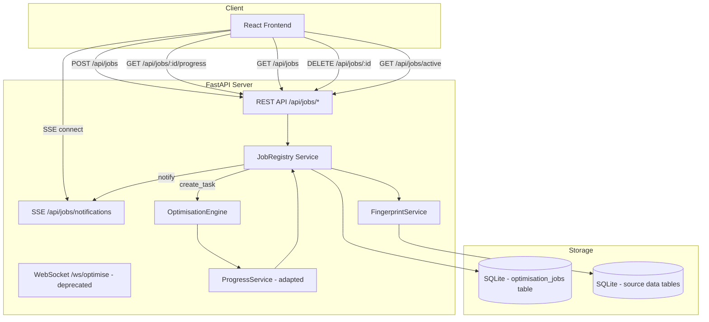
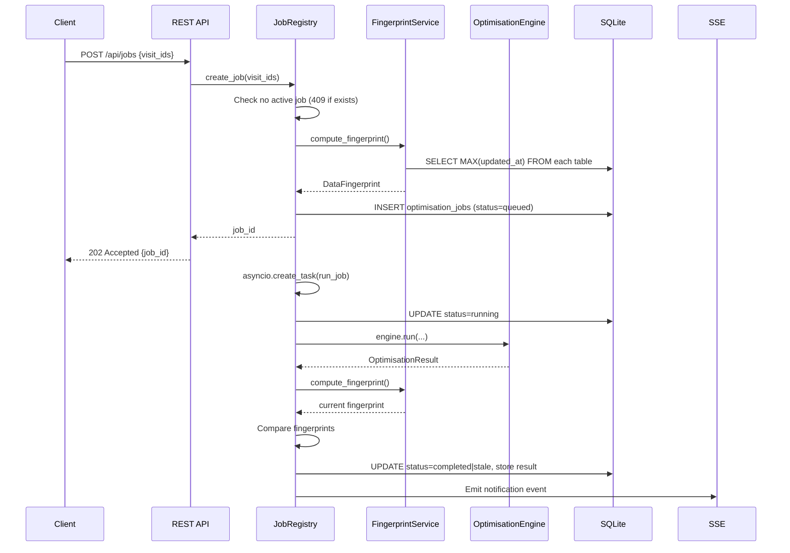

# Design Document: Background Optimisation Jobs

## Overview

This feature decouples the care visit optimisation solver from the WebSocket page lifecycle, enabling optimisation runs to persist as background jobs on the server. The design introduces a Job Registry backed by SQLite, REST endpoints for job management and progress polling, Server-Sent Events (SSE) for push notifications, data fingerprinting for staleness detection, and an edit guard mechanism to warn users about in-flight invalidation.

The existing WebSocket endpoint (`/ws/optimise`) remains operational for backward compatibility during a transition period but is marked as deprecated. New optimisation runs should use the REST-based job submission flow.

### Key Design Decisions

1. **SQLite for job storage** — Aligns with the existing data layer (aiosqlite). No new infrastructure needed.
2. **SSE over WebSocket for notifications** — Lighter weight than a full WebSocket for one-way server→client push. The notification channel only delivers small JSON payloads (job status changes), making SSE ideal.
3. **asyncio.create_task for background execution** — The existing `OptimisationEngine.run_solver_in_background()` already uses `run_in_executor` for the CPU-bound solver. We wrap this in a persistent `asyncio.Task` that outlives any client connection.
4. **Fingerprinting via max(updated_at)** — Simple, transactional, and requires no additional columns. Each source table already has `updated_at`.
5. **Single active job constraint** — Simplifies resource management. The OR-Tools solver is CPU-intensive; concurrent jobs would degrade quality.

## Architecture



### Request Flow — Job Submission



## Components and Interfaces

### 1. JobRegistry Service (`backend/app/services/job_registry.py`)

The central orchestrator for background job lifecycle management.

```python
class JobRegistry:
    """Manages background optimisation job lifecycle."""

    async def create_job(self, visit_ids: list[int] | None = None) -> str:
        """Create a new job, compute fingerprint, launch background task.
        
        Returns: UUID v4 job identifier.
        Raises: JobConflictError if an active job exists.
        """

    async def get_job(self, job_id: str) -> JobRecord | None:
        """Retrieve a job by ID."""

    async def get_job_progress(self, job_id: str) -> JobProgress | None:
        """Get current progress snapshot for a running/completed job."""

    async def list_jobs(self) -> list[JobSummary]:
        """List all retained jobs, newest first."""

    async def cancel_job(self, job_id: str) -> bool:
        """Cancel a queued/running job. Returns True if cancelled."""

    async def check_active_job(self) -> ActiveJobInfo | None:
        """Return info about the currently running job, or None."""

    async def update_progress(self, job_id: str, progress: JobProgress) -> None:
        """Called by the adapted ProgressService to update progress state."""

    async def cleanup_old_jobs(self) -> None:
        """Remove jobs beyond the 20-job retention limit."""
```

### 2. FingerprintService (`backend/app/services/fingerprint.py`)

```python
@dataclass
class DataFingerprint:
    """Snapshot of max(updated_at) per source table."""
    carers_max: str | None       # ISO 8601 or None
    visits_max: str | None
    patients_max: str | None
    constraints_max: str | None

    def differs_from(self, other: "DataFingerprint") -> tuple[bool, dict[str, bool]]:
        """Compare two fingerprints. Returns (is_different, per_table_diff)."""

class FingerprintService:
    async def compute(self) -> DataFingerprint:
        """Compute current fingerprint in a single transaction."""
```

### 3. REST API Router (`backend/app/routes/jobs.py`)

| Method | Path | Description | Response |
|--------|------|-------------|----------|
| POST | `/api/jobs` | Create new job | 202 `{job_id}` / 409 Conflict |
| GET | `/api/jobs` | List all retained jobs | 200 `[JobSummary]` |
| GET | `/api/jobs/active` | Check if a job is currently running | 200 `{active: bool, job_id?}` |
| GET | `/api/jobs/{job_id}/progress` | Get job progress | 200 `JobProgress` / 404 |
| DELETE | `/api/jobs/{job_id}` | Cancel a job | 200 / 404 / 409 |

### 4. SSE Notification Endpoint (`backend/app/routes/jobs.py`)

| Method | Path | Description |
|--------|------|-------------|
| GET | `/api/jobs/notifications` | SSE stream for job status change events |

The SSE endpoint uses `StreamingResponse` with `text/event-stream` content type. Events are pushed from the JobRegistry via an `asyncio.Queue` per connected client.

### 5. Adapted ProgressService

The existing `ProgressService` is tightly coupled to `OptimisationSession` (WebSocket). We introduce a `JobProgressAdapter` that implements the same interface but writes progress to the JobRegistry instead of a WebSocket:

```python
class JobProgressAdapter:
    """Adapts ProgressService callbacks to write to JobRegistry."""

    def __init__(self, job_registry: JobRegistry, job_id: str):
        self._registry = job_registry
        self._job_id = job_id

    # Implements the same emit interface as ProgressService
    # but persists to DB + notifies SSE subscribers
```

### 6. Background Task Runner

```python
async def _execute_job(job_id: str, visit_ids: list[int] | None, registry: JobRegistry):
    """The background coroutine that runs the full optimisation pipeline."""
    # 1. Update status to "running"
    # 2. Fetch source data (carers, visits, patients, constraints)
    # 3. Build travel matrix (via GoogleMapsClient)
    # 4. Run OptimisationEngine with JobProgressAdapter
    # 5. On success: compare fingerprints, store result, set completed/stale
    # 6. On failure: store error, set failed
    # 7. Emit notification via SSE
```

The task is created via `asyncio.create_task()` and stored on the JobRegistry instance so it can be cancelled via `task.cancel()`.

## Data Models

### Database Schema — `optimisation_jobs` Table

```sql
CREATE TABLE IF NOT EXISTS optimisation_jobs (
    id TEXT PRIMARY KEY,                    -- UUID v4
    status TEXT NOT NULL DEFAULT 'queued'
        CHECK(status IN ('queued', 'running', 'completed', 'failed', 'stale', 'cancelled')),
    visit_ids TEXT NOT NULL DEFAULT '[]',   -- JSON array of visit IDs
    
    -- Fingerprint at creation
    fingerprint_carers TEXT,               -- ISO 8601 max(updated_at) or NULL
    fingerprint_visits TEXT,
    fingerprint_patients TEXT,
    fingerprint_constraints TEXT,
    
    -- Progress (updated in-flight)
    elapsed_seconds INTEGER NOT NULL DEFAULT 0,
    percentage_complete INTEGER NOT NULL DEFAULT 0,
    solutions_found INTEGER NOT NULL DEFAULT 0,
    current_best_score REAL,
    
    -- Result (populated on completion)
    result_json TEXT,                       -- Full OptimisationResult JSON blob
    error_message TEXT,                    -- Max 1000 chars, populated on failure
    
    -- Staleness detail
    is_stale INTEGER NOT NULL DEFAULT 0,
    stale_tables TEXT,                     -- JSON: {"carers": false, "visits": true, ...}
    
    -- Timestamps
    created_at TEXT NOT NULL DEFAULT (datetime('now')),
    started_at TEXT,
    completed_at TEXT,
    
    -- Cancellation support
    cancelled_at TEXT
);

CREATE INDEX IF NOT EXISTS idx_optimisation_jobs_status ON optimisation_jobs(status);
CREATE INDEX IF NOT EXISTS idx_optimisation_jobs_created_at ON optimisation_jobs(created_at);
```

### Pydantic Models (`backend/app/models/job.py`)

```python
from pydantic import BaseModel, Field
from typing import Optional

class JobCreateRequest(BaseModel):
    visit_ids: list[int] | None = None

class JobCreateResponse(BaseModel):
    job_id: str

class JobProgress(BaseModel):
    job_id: str
    status: str  # queued | running | completed | failed | stale | cancelled
    elapsed_seconds: int = 0
    percentage_complete: int = Field(ge=0, le=100, default=0)
    solutions_found: int = 0
    current_best_score: float | None = None
    is_stale: bool = False
    stale_tables: dict[str, bool] | None = None

class JobSummary(BaseModel):
    job_id: str
    status: str
    created_at: str
    started_at: str | None = None
    completed_at: str | None = None
    is_stale: bool = False
    visit_count: int = 0

class ActiveJobInfo(BaseModel):
    active: bool
    job_id: str | None = None
    status: str | None = None

class JobNotificationEvent(BaseModel):
    event_type: str  # "job_completed" | "job_failed" | "job_stale"
    job_id: str
    message: str
    error_summary: str | None = None  # max 200 chars for failed jobs
```

### SSE Event Format

```
event: job_status
data: {"event_type": "job_completed", "job_id": "abc-123", "message": "Optimisation complete"}

event: job_status
data: {"event_type": "job_failed", "job_id": "abc-123", "message": "Optimisation failed", "error_summary": "Maps API timeout"}
```

## Correctness Properties

*A property is a characteristic or behavior that should hold true across all valid executions of a system — essentially, a formal statement about what the system should do. Properties serve as the bridge between human-readable specifications and machine-verifiable correctness guarantees.*

### Property 1: Job creation produces a valid record

*For any* valid list of visit IDs (including None), creating a job shall produce a record with a valid UUID v4 identifier, status "queued", a non-null creation timestamp in ISO 8601 format, a DataFingerprint with entries for all four source tables, and the original visit IDs stored as a JSON array.

**Validates: Requirements 1.1, 1.2**

### Property 2: Completion stores a valid OptimisationResult

*For any* job that completes successfully, the stored result_json field shall deserialize to a valid OptimisationResult (containing routes, objective_score, kpis, recommendations, unassigned_visits, and infeasibility_reasons), and completed_at shall be a valid UTC ISO 8601 timestamp that is greater than or equal to started_at.

**Validates: Requirements 1.4**

### Property 3: Error and notification strings are truncated to their respective limits

*For any* error string of arbitrary length, the stored error_message shall be at most 1000 characters and shall be a prefix of the original string. *For any* notification error_summary, it shall be at most 200 characters and shall be a prefix of the error_message.

**Validates: Requirements 1.5, 3.2**

### Property 4: Progress response contains all required fields with valid ranges

*For any* job in any status (queued, running, completed, failed, stale, cancelled), the progress response shall contain: status (matching the enum), elapsed_seconds (non-negative integer), percentage_complete (integer in [0, 100]), solutions_found (non-negative integer), current_best_score (numeric or null), is_stale (boolean), and stale_tables (dict with keys "carers", "visits", "patients", "constraints" each mapping to a boolean, or null if not stale).

**Validates: Requirements 2.1, 4.4**

### Property 5: Fingerprint correctly captures max(updated_at) per source table

*For any* state of the source data tables, compute_fingerprint shall return the maximum updated_at value from each table (carers, visits, patients, constraints), or None for tables with no rows, and the computation shall be performed within a single database transaction to guarantee a consistent snapshot.

**Validates: Requirements 4.1**

### Property 6: Staleness detection on fingerprint divergence

*For any* two DataFingerprint instances A (creation-time) and B (current), differs_from shall return True if and only if at least one table's timestamp differs (including transitions between None and a non-None value). When a job completes and the fingerprints differ, the final status shall be "stale" rather than "completed". When source data is modified after a job has status "completed", the job's status shall transition to "stale".

**Validates: Requirements 4.2, 4.3, 5.4**

### Property 7: Active job check accurately reflects registry state

*For any* registry state, GET /api/jobs/active shall return active=True if and only if there exists at least one job with status "queued" or "running". When active=True, the response shall include the job_id of the active job.

**Validates: Requirements 6.1, 6.5**

### Property 8: Job list is ordered by creation timestamp descending

*For any* set of jobs in the registry, GET /api/jobs shall return them ordered by created_at descending (newest first), and each entry shall include job_id, created_at, status, completed_at (if applicable), and is_stale flag.

**Validates: Requirements 7.1**

### Property 9: Cleanup retains at most 20 jobs and preserves recent jobs

*For any* registry state after cleanup, the number of retained jobs shall be at most 20. Jobs whose completed_at is less than 24 hours ago shall never be removed by cleanup. When jobs must be removed, they shall be the oldest by completion timestamp.

**Validates: Requirements 7.2, 7.3**

### Property 10: Single active job invariant with conflict enforcement

*For any* sequence of job creation attempts, at most one job shall have status "queued" or "running" at any point in time. If a job creation is attempted while an active job exists, the system shall reject it with HTTP 409 and include the active job's identifier in the response.

**Validates: Requirements 7.4, 7.5**

### Property 11: Cancellation transitions job to "cancelled" with no stored results

*For any* job with status "queued" or "running", invoking DELETE shall transition its status to "cancelled", set cancelled_at to a valid timestamp, and the job shall have no result_json stored.

**Validates: Requirements 7.6**


## Error Handling

### Job Execution Errors

| Error Source | Handling Strategy | Stored Information |
|---|---|---|
| Google Maps API timeout/failure | Set status="failed", store error message (truncated to 1000 chars) | `error_message`, `completed_at` |
| OR-Tools solver no solution | Set status="failed", store "No feasible solution found" | `error_message`, `completed_at` |
| Unexpected exception in task | Catch-all handler sets status="failed", logs stack trace, stores first 1000 chars of exception | `error_message`, `completed_at` |
| Database write failure during job | Retry once after 1 second; if still failing, set in-memory status to failed and log critical | Best-effort DB write |
| asyncio.CancelledError | Set status="cancelled", clean up resources, do not store results | `cancelled_at` |

### API Error Responses

| Endpoint | Error Condition | HTTP Status | Response Body |
|---|---|---|---|
| POST /api/jobs | Active job exists | 409 Conflict | `{"detail": "Optimisation already in progress", "active_job_id": "..."}` |
| POST /api/jobs | No visits available | 422 Unprocessable | `{"detail": "No visits available for optimisation"}` |
| GET /api/jobs/{id}/progress | Job not found | 404 Not Found | `{"detail": "Job not found"}` |
| DELETE /api/jobs/{id} | Job not found | 404 Not Found | `{"detail": "Job not found"}` |
| DELETE /api/jobs/{id} | Job already completed/failed | 409 Conflict | `{"detail": "Job is not active", "status": "..."}` |

### SSE Connection Resilience

- The SSE endpoint sends a heartbeat comment (`: heartbeat\n\n`) every 15 seconds to detect broken connections.
- If the client disconnects, the server removes their notification queue from the subscriber set.
- On reconnect, the client sends `Last-Event-ID` header. The server replays any notifications emitted after that ID from a bounded in-memory buffer (last 10 events, max 5 minutes old).

### Fingerprint Computation Failures

- If the fingerprint query fails during job creation, the job creation fails with HTTP 500.
- If the fingerprint query fails at job completion, the job is stored as "completed" (not "stale") and a warning is logged. The staleness check will be retried on the next source data modification.

### Cancellation Race Conditions

- If a job completes in the instant between the cancel request and the `task.cancel()` call, the system honours the completion (does not overwrite to "cancelled").
- The background task checks for cancellation (`asyncio.current_task().cancelled()`) at key checkpoints: after distance matrix fetch and before solver execution.

## Testing Strategy

### Property-Based Tests (Hypothesis)

Property-based testing is appropriate for this feature because the core logic involves:
- Pure data transformations (fingerprint computation, comparison)
- State machine transitions with invariants (job status lifecycle)
- Data validation (response format, truncation, ordering)

**Library:** Hypothesis (already in `requirements.txt` as `hypothesis==6.156.6`)

**Configuration:** Minimum 100 iterations per property test.

Each property test must be tagged with a comment referencing the design property:
```python
# Feature: background-optimisation-jobs, Property 1: Job creation produces a valid record
```

**Properties to implement:**

1. **Job creation record validity** — Generate random visit_id lists (including None, empty, and lists with various integer IDs). Verify the created record satisfies all structural invariants.
2. **Error string truncation** — Generate arbitrary-length strings. Verify truncation preserves prefix and respects length limits.
3. **Progress response field validity** — Generate jobs in all possible statuses. Verify response schema.
4. **Fingerprint computation** — Generate random sets of records with various updated_at values. Verify max is correctly identified.
5. **Fingerprint comparison** — Generate pairs of DataFingerprint instances. Verify differs_from returns correct boolean and per-table breakdown.
6. **Staleness detection** — Generate job + fingerprint pairs where fingerprints may or may not differ. Verify status assignment.
7. **Active job check** — Generate registry states with 0-3 jobs in various statuses. Verify active detection.
8. **Job list ordering** — Generate sets of jobs with random timestamps. Verify descending order.
9. **Cleanup invariants** — Generate registries with 0-30 jobs with various ages. Verify post-cleanup state.
10. **Single active job enforcement** — Generate sequences of create_job attempts. Verify at most one is active.
11. **Cancellation transition** — Generate active jobs. Verify status transitions and result absence.

### Unit Tests (pytest)

Unit tests complement property tests for specific scenarios:

- Job status state machine: verify valid transitions (queued→running→completed, queued→cancelled, running→failed, etc.)
- Invalid transitions rejected (completed→running, failed→queued, etc.)
- SSE event serialization format
- REST endpoint response codes for happy paths
- Fingerprint with empty tables returns None values
- Cleanup does not remove running/queued jobs

### Integration Tests

- Full job lifecycle: POST → poll progress → verify completion → GET result
- Cancellation during solver execution: verify task halts within 5 seconds
- SSE notification delivery on job completion
- Staleness detection after source data edit during running job
- Backward compatibility: existing WebSocket endpoint still functions

### WebSocket Deprecation Path

The existing `/ws/optimise` endpoint remains functional but is extended with a deprecation warning in the handshake response. New clients should use:
1. `POST /api/jobs` to start optimisation
2. `GET /api/jobs/{id}/progress` for polling
3. `GET /api/jobs/notifications` (SSE) for push notifications

The WebSocket endpoint will be removed in a future version once all clients have migrated.
