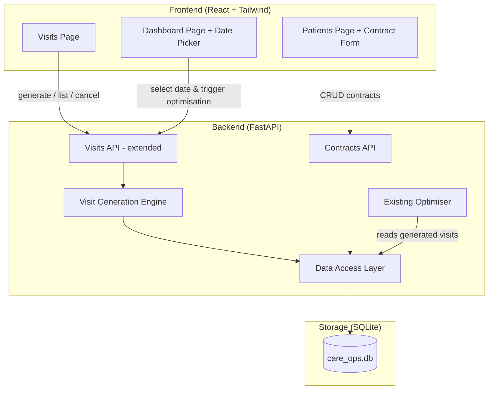
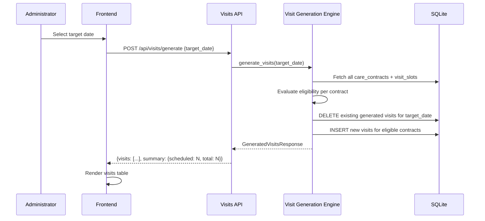

# Design Document: Care Contracts & Visit Generation

## Overview

This feature extends the AI Care Operations Optimiser with a contract-based visit generation model. Instead of pre-seeded static visits, patients receive care contracts defining their recurring care needs. A visit generation engine evaluates active contracts against a selected target date and produces visits dynamically, which then feed into the existing optimisation pipeline.

The design adds three main capabilities:
1. **Care Contract data model and CRUD** — persisted alongside patient records
2. **Visit Generation Engine** — a pure-logic service that evaluates frequency rules and produces visits
3. **Frontend additions** — a Visits page, contract form within patient edit, and date picker on Dashboard

### Key Design Decisions

| Decision | Choice | Rationale |
|----------|--------|-----------|
| Contract storage | New `care_contracts` + `visit_slots` tables | Normalised structure; slots vary per contract and benefit from separate indexing |
| Visit generation approach | On-demand per target date | Avoids pre-computing a calendar of future visits; keeps the DB lean |
| Generated visits storage | Reuse existing `visits` table + `target_date`/`contract_id` columns | The optimiser already consumes from `visits`; extending it minimises integration work |
| Frequency logic | Pure Python function (no ORM) | Deterministic date arithmetic is ideal for property-based testing |
| Date picker library | Native HTML `<input type="date">` | Zero dependencies; sufficient for single-date selection |
| Existing visits compatibility | Generated visits use same schema | The optimiser's `VisitModel` is unchanged; new columns are additive |

## Architecture



### Visit Generation Flow



## Components and Interfaces

### New Backend Components

#### Visit Generation Engine (`backend/app/services/visit_generator.py`)

```python
class VisitGenerator:
    """Pure-logic engine that produces visits from care contracts for a target date."""

    def is_contract_eligible(self, contract: CareContractModel, target_date: date) -> bool:
        """Determine if a contract should generate visits for the given date."""
        ...

    def check_frequency(self, frequency: VisitFrequency, start_date: date,
                        target_date: date, days_of_week: list[str] | None) -> bool:
        """Evaluate whether the target_date satisfies the contract's frequency rule."""
        ...

    async def generate_visits(self, target_date: date) -> list[VisitModel]:
        """Generate all visits for the target date from active contracts."""
        ...
```

#### Contracts API (`backend/app/routes/contracts.py`)

| Method | Path | Request | Response | Purpose |
|--------|------|---------|----------|---------|
| GET | `/api/patients/{id}/contract` | — | `CareContractModel \| null` | Get patient's contract |
| PUT | `/api/patients/{id}/contract` | `CareContractCreate` | `CareContractModel` | Create or update contract |
| DELETE | `/api/patients/{id}/contract` | — | `204` | Remove contract |

#### Extended Visits API (`backend/app/routes/visits.py` — extended)

| Method | Path | Request | Response | Purpose |
|--------|------|---------|----------|---------|
| GET | `/api/visits?target_date=YYYY-MM-DD` | query param | `VisitModel[]` | List visits for a date |
| POST | `/api/visits/generate` | `{target_date: str}` | `GenerateResponse` | Generate visits for date |
| POST | `/api/visits/regenerate` | `{target_date: str}` | `GenerateResponse` | Reset cancelled + regenerate |
| PATCH | `/api/visits/{id}/cancel` | — | `VisitModel` | Cancel single visit |

### New Frontend Components

| Component | Location | Responsibility |
|-----------|----------|---------------|
| `VisitsPage` | `/visits` route | Table of generated visits, generate/regenerate buttons, date picker |
| `ContractForm` | Within `PatientsPage` edit flow | Full contract CRUD form with slots, frequency, dates |
| `DatePicker` | Shared component | Reusable date input with validation (no past dates) |
| `VisitStatusBadge` | Within `VisitsPage` | Displays "Scheduled" or "Cancelled" with colour coding |

### Navigation Changes

The `NavSidebar` gains a "Visits" item positioned between "Patients" and "Skills":

```typescript
const navItems = [
  { to: '/', label: 'Dashboard', icon: '📊' },
  { to: '/carers', label: 'Carers', icon: '👤' },
  { to: '/patients', label: 'Patients', icon: '🏠' },
  { to: '/visits', label: 'Visits', icon: '📅' },  // NEW
  { to: '/skills', label: 'Skills', icon: '🎯' },
  // ... rest unchanged
];
```

### Dashboard Integration

The `DashboardPage` gains a date picker above the "Run Optimisation" button. When the date changes:
1. Frontend calls `POST /api/visits/generate` with the new target date (if visits don't already exist)
2. The optimisation WebSocket `start` message includes `{ targetDate: "YYYY-MM-DD" }`
3. The backend optimiser filters to only `scheduled` visits for that date

## Data Models

### New Database Tables

```sql
CREATE TABLE IF NOT EXISTS care_contracts (
    id INTEGER PRIMARY KEY AUTOINCREMENT,
    patient_id INTEGER NOT NULL UNIQUE REFERENCES patients(id),
    visit_frequency TEXT NOT NULL CHECK(visit_frequency IN ('daily', 'weekdays_only', 'specific_days', 'alternate_days', 'weekly')),
    days_of_week TEXT,  -- JSON array e.g. ["mon","tue","fri"], required when frequency=specific_days
    visits_per_day INTEGER NOT NULL CHECK(visits_per_day >= 1 AND visits_per_day <= 4),
    start_date TEXT NOT NULL,  -- YYYY-MM-DD
    end_date TEXT,  -- YYYY-MM-DD or NULL for ongoing
    excluded_dates TEXT NOT NULL DEFAULT '[]',  -- JSON array of YYYY-MM-DD strings
    created_at TEXT NOT NULL DEFAULT (datetime('now')),
    updated_at TEXT NOT NULL DEFAULT (datetime('now'))
);

CREATE TABLE IF NOT EXISTS visit_slots (
    id INTEGER PRIMARY KEY AUTOINCREMENT,
    contract_id INTEGER NOT NULL REFERENCES care_contracts(id) ON DELETE CASCADE,
    slot_index INTEGER NOT NULL,  -- 0-based ordering within contract
    label TEXT NOT NULL CHECK(length(label) >= 1 AND length(label) <= 100),
    earliest_start TEXT NOT NULL,  -- HH:MM format
    latest_start TEXT NOT NULL,    -- HH:MM format
    duration_minutes INTEGER NOT NULL CHECK(duration_minutes >= 15 AND duration_minutes <= 120),
    required_skills TEXT NOT NULL DEFAULT '[]',  -- JSON array of skill names
    UNIQUE(contract_id, slot_index)
);
```

### Extended `visits` Table

Two new columns added to the existing `visits` table:

```sql
ALTER TABLE visits ADD COLUMN target_date TEXT;  -- YYYY-MM-DD, NULL for legacy pre-seeded visits
ALTER TABLE visits ADD COLUMN contract_id INTEGER REFERENCES care_contracts(id);
```

The existing schema remains intact — `duration_minutes` constraint is widened from `<= 90` to `<= 120` to match contract slot durations.

### Python Models (Backend — Pydantic)

```python
from pydantic import BaseModel, Field
from typing import Optional
from enum import Enum
from datetime import date


class VisitFrequency(str, Enum):
    DAILY = "daily"
    WEEKDAYS_ONLY = "weekdays_only"
    SPECIFIC_DAYS = "specific_days"
    ALTERNATE_DAYS = "alternate_days"
    WEEKLY = "weekly"


class DayOfWeek(str, Enum):
    MON = "mon"
    TUE = "tue"
    WED = "wed"
    THU = "thu"
    FRI = "fri"
    SAT = "sat"
    SUN = "sun"


class VisitSlotModel(BaseModel):
    id: int
    contract_id: int
    slot_index: int
    label: str = Field(min_length=1, max_length=100)
    earliest_start: str  # HH:MM
    latest_start: str    # HH:MM
    duration_minutes: int = Field(ge=15, le=120)
    required_skills: list[str] = []


class VisitSlotCreate(BaseModel):
    label: str = Field(min_length=1, max_length=100)
    earliest_start: str  # HH:MM, validated 06:00-22:00
    latest_start: str    # HH:MM, must be > earliest_start
    duration_minutes: int = Field(ge=15, le=120)
    required_skills: list[str] = []


class CareContractModel(BaseModel):
    id: int
    patient_id: int
    visit_frequency: VisitFrequency
    days_of_week: Optional[list[DayOfWeek]] = None
    visits_per_day: int = Field(ge=1, le=4)
    start_date: date
    end_date: Optional[date] = None
    excluded_dates: list[date] = []
    visit_slots: list[VisitSlotModel] = []


class CareContractCreate(BaseModel):
    visit_frequency: VisitFrequency
    days_of_week: Optional[list[DayOfWeek]] = None
    visits_per_day: int = Field(ge=1, le=4)
    start_date: date
    end_date: Optional[date] = None
    excluded_dates: list[date] = []
    visit_slots: list[VisitSlotCreate] = []


class GenerateVisitsRequest(BaseModel):
    target_date: date


class GenerateVisitsResponse(BaseModel):
    visits: list["VisitModel"]
    scheduled_count: int
    total_contracts_evaluated: int
    eligible_contracts: int
```

### TypeScript Models (Frontend)

```typescript
type VisitFrequency = 'daily' | 'weekdays_only' | 'specific_days' | 'alternate_days' | 'weekly';
type DayOfWeek = 'mon' | 'tue' | 'wed' | 'thu' | 'fri' | 'sat' | 'sun';

interface VisitSlot {
  id?: number;
  slotIndex: number;
  label: string;
  earliestStart: string; // HH:MM
  latestStart: string;   // HH:MM
  durationMinutes: number;
  requiredSkills: string[];
}

interface CareContract {
  id: number;
  patientId: number;
  visitFrequency: VisitFrequency;
  daysOfWeek: DayOfWeek[] | null;
  visitsPerDay: number;
  startDate: string; // YYYY-MM-DD
  endDate: string | null;
  excludedDates: string[];
  visitSlots: VisitSlot[];
}

interface CareContractCreate {
  visitFrequency: VisitFrequency;
  daysOfWeek?: DayOfWeek[];
  visitsPerDay: number;
  startDate: string;
  endDate?: string | null;
  excludedDates?: string[];
  visitSlots: Omit<VisitSlot, 'id'>[];
}

// Extended Visit with target_date context
interface Visit {
  id: number;
  patientId: number;
  durationMinutes: number;
  windowStart: string;
  windowEnd: string;
  requiredSkills: string[];
  preferredTime: string | null;
  isCancelled: boolean;
  targetDate: string | null;   // NEW
  contractId: number | null;   // NEW
}

interface GenerateVisitsResponse {
  visits: Visit[];
  scheduledCount: number;
  totalContractsEvaluated: number;
  eligibleContracts: number;
}
```


## Correctness Properties

*A property is a characteristic or behavior that should hold true across all valid executions of a system — essentially, a formal statement about what the system should do. Properties serve as the bridge between human-readable specifications and machine-verifiable correctness guarantees.*

### Property 1: Contract Validation Invariant

*For any* `CareContractCreate` payload, the system SHALL accept it if and only if: `visit_frequency` is one of the five valid enum values, `days_of_week` is non-empty and contains only valid day values when frequency is `specific_days`, `visits_per_day` is between 1 and 4 inclusive, `end_date` is null or >= `start_date`, and the number of `visit_slots` equals `visits_per_day`. All other payloads SHALL be rejected with validation errors.

**Validates: Requirements 1.1, 1.2, 1.6, 1.8, 5.9**

### Property 2: Visit Slot Validation

*For any* `VisitSlotCreate` payload, the system SHALL accept it if and only if: `label` is between 1 and 100 characters, `earliest_start` is in HH:MM format between 06:00 and 22:00, `latest_start` is in HH:MM format and strictly greater than `earliest_start`, `duration_minutes` is between 15 and 120 inclusive, and `required_skills` contains only names present in the skills table. All other payloads SHALL be rejected.

**Validates: Requirements 1.4, 5.9**

### Property 3: Contract Persistence Round-Trip

*For any* valid `CareContractCreate` payload submitted for a patient, fetching the contract for that patient SHALL return an equivalent object with all fields preserved (visit_frequency, days_of_week, visits_per_day, start_date, end_date, excluded_dates, and all visit_slot fields).

**Validates: Requirements 5.8**

### Property 4: Frequency Rule Correctness

*For any* care contract with a given `visit_frequency`, `start_date`, and `days_of_week`, and *for any* target date, the frequency check SHALL return:
- `True` for `daily` (always)
- `True` for `weekdays_only` if and only if target is Monday–Friday
- `True` for `specific_days` if and only if the target's day-of-week is in `days_of_week`
- `True` for `alternate_days` if and only if `(target_date - start_date).days % 2 == 0`
- `True` for `weekly` if and only if `target_date.weekday() == start_date.weekday()`

**Validates: Requirements 2.3, 2.4, 2.5, 2.6, 2.7**

### Property 5: Eligibility Determination

*For any* care contract and *for any* target date, the contract SHALL be eligible if and only if all three conditions hold: (1) `target_date >= start_date`, (2) `end_date is None OR target_date <= end_date`, and (3) `target_date` is not in `excluded_dates`.

**Validates: Requirements 2.2**

### Property 6: Visit Generation Output Correctness

*For any* set of care contracts where N contracts are eligible for a target date, the visit generation engine SHALL produce exactly `sum(contract.visits_per_day for eligible contracts)` visits, and each generated visit SHALL have `patient_id` matching the contract's patient, `window_start` equal to the slot's `earliest_start`, `window_end` equal to the slot's `latest_start`, `duration_minutes` equal to the slot's `duration_minutes`, and `required_skills` equal to the slot's `required_skills`.

**Validates: Requirements 2.1, 2.8, 6.5**

### Property 7: Default Date Calculation

*For any* date representing "today", the computed default target date SHALL equal today if today is Monday–Friday, or the next Monday if today is Saturday or Sunday.

**Validates: Requirements 3.1**

### Property 8: Past Date Validation

*For any* selected date and *for any* reference date representing "today", the system SHALL reject the selected date if and only if `selected_date < today`.

**Validates: Requirements 3.2**

### Property 9: Generation Replaces Previous Visits

*For any* target date that already has generated visits, invoking visit generation SHALL result in the visits table containing only the newly generated visits for that date (all previous visits for that date are removed, including cancelled ones), and all new visits have status "scheduled".

**Validates: Requirements 4.4, 4.5**

### Property 10: Cancel State Transition

*For any* generated visit with status "scheduled", cancelling it SHALL change its status to "cancelled" and leave all other visits for the same target date unchanged.

**Validates: Requirements 4.3**

### Property 11: Visit Count Derivation

*For any* set of visits for a target date, the scheduled count SHALL equal the number of visits where `is_cancelled == False`, and the cancelled count SHALL equal the number where `is_cancelled == True`, and `scheduled_count + cancelled_count` SHALL equal the total number of visits for that date.

**Validates: Requirements 4.7**

## Error Handling

### Validation Errors

| Scenario | HTTP Status | Response |
|----------|-------------|----------|
| Invalid frequency value | 422 | Field-level error on `visit_frequency` |
| Slot count ≠ visits_per_day | 422 | `"visit_slots count (N) must equal visits_per_day (M)"` |
| earliest_start ≥ latest_start | 422 | Field-level error on slot `latest_start` |
| Duration outside 15–120 | 422 | Field-level error on slot `duration_minutes` |
| end_date < start_date | 422 | `"end_date must be on or after start_date"` |
| Past date selected | 400 | `"Target date cannot be in the past"` |
| Missing required fields | 422 | Pydantic validation errors |
| Referenced skill not found | 422 | `"Skill '{name}' does not exist"` |
| Patient not found | 404 | `"Patient with id {id} not found"` |

### Generation Errors

| Scenario | Handling |
|----------|----------|
| No eligible contracts | Return empty visits array + informational message |
| Database error during generation | 500 + rollback partial inserts (use transaction) |
| Contract references deleted patient | Skip contract, log warning |

### Frontend Error Handling

- **Form validation**: Client-side validation mirrors backend rules; displays inline errors beneath fields
- **API errors**: Toast notifications for failed save/generate operations
- **Empty state**: Dedicated empty-state component when no visits exist for selected date
- **Network failures**: Retry button on generation failure

## Testing Strategy

### Testing Pyramid

```
        ┌──────────┐
        │   E2E    │  ← Generate visits → optimise flow (Playwright)
       ─┼──────────┼─
       │ Integration │  ← API flows: contract CRUD, visit generation (pytest + httpx)
      ─┼────────────┼─
     │  Property Tests │  ← Frequency logic, eligibility, validation (Hypothesis)
    ─┼──────────────────┼─
   │     Unit Tests       │  ← Date helpers, count derivation, UI components (pytest + Vitest)
  ─┼──────────────────────┼─
```

### Property-Based Testing (Hypothesis — Python)

The visit generation engine's frequency and eligibility logic, along with contract validation, are pure functions ideal for property-based testing. We use [Hypothesis](https://hypothesis.readthedocs.io/).

**Configuration:**
- Minimum 100 examples per property test
- Each test tagged with: `# Feature: care-contracts-visit-generation, Property {N}: {title}`
- Custom strategies for generating valid `CareContractCreate`, `VisitSlotCreate`, date ranges, and frequency/day combinations

**Properties to implement:**
- Property 1: Contract validation (backend)
- Property 2: Visit slot validation (backend)
- Property 3: Contract persistence round-trip (backend integration)
- Property 4: Frequency rule correctness (backend — pure function)
- Property 5: Eligibility determination (backend — pure function)
- Property 6: Visit generation output correctness (backend)
- Property 7: Default date calculation (frontend + backend)
- Property 8: Past date validation (frontend + backend)
- Property 9: Generation replaces previous visits (backend integration)
- Property 10: Cancel state transition (backend)
- Property 11: Visit count derivation (backend + frontend)

### Unit Testing

**Backend (pytest):**
- `check_frequency()` with specific date examples per frequency type
- Contract creation with boundary values (1 slot, 4 slots)
- Excluded dates parsing and matching
- Visit generation with a single eligible contract (verifies field mapping)
- Cancellation of non-existent visit returns 404

**Frontend (Vitest):**
- `ContractForm` renders correct fields per frequency selection
- `DatePicker` computes correct default date
- `VisitsPage` renders correct column count
- Visit count badges show correct numbers
- Form validation error display

### Integration Testing

**Backend (pytest + httpx):**
- Full contract CRUD lifecycle: create → read → update → delete
- Visit generation end-to-end: create contracts → generate for date → verify visits in DB
- Optimisation integration: generate visits → trigger optimise → verify only scheduled visits used
- Seed data verification: all 12 patients have contracts after init
- Idempotent seeding: restart does not overwrite modified contracts

**Frontend (Vitest + MSW):**
- Visits page loads and calls correct API with target_date param
- Generate button triggers POST and refreshes table
- Cancel button sends PATCH and updates row status
- Date picker change triggers regeneration
