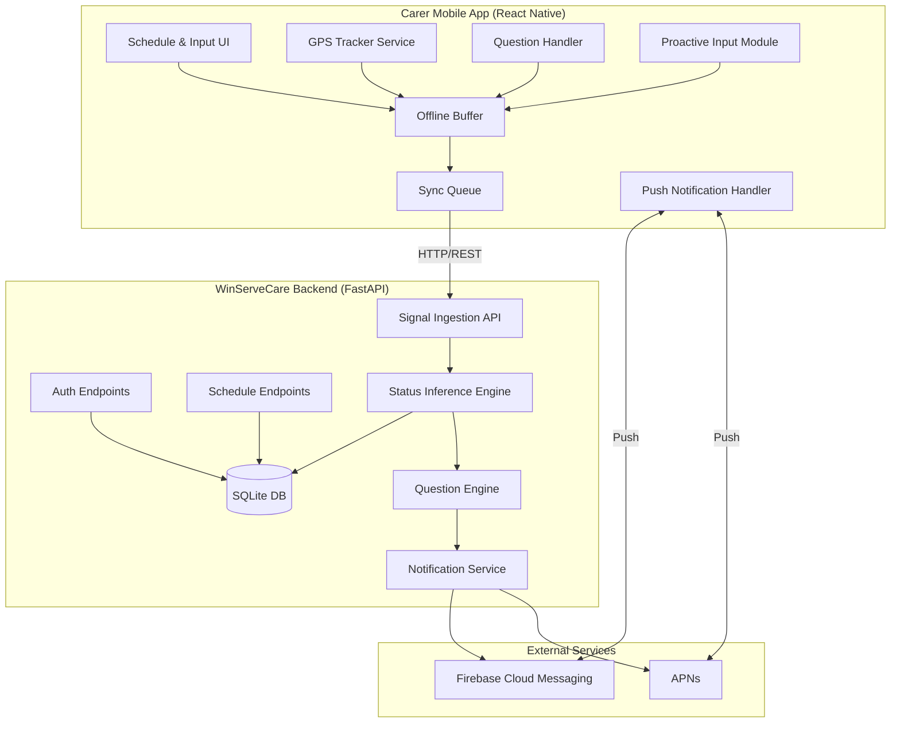
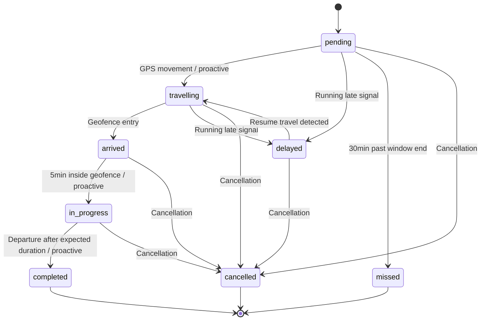
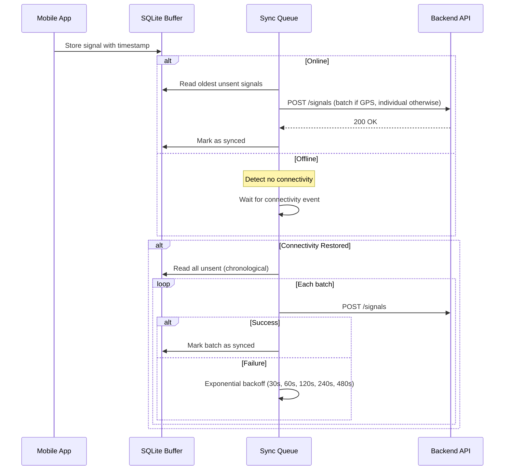

# Design Document: Carer Mobile App

## Overview

The Carer Mobile App extends the WinServeCare scheduling system with a cross-platform mobile application (React Native) and backend enhancements. The system introduces three signal mechanisms — GPS tracking, contextual questions, and proactive input — that feed into a server-side Status Inference Engine. This engine maintains real-time visit status by combining signals with configurable confidence scoring, a defined state machine, and geofence-based proximity detection.

The design prioritises offline resilience, battery efficiency, and minimal data usage while ensuring the backend always has the best available picture of carer activity.

## Architecture

### High-Level System Architecture



### Technology Choices

| Component | Technology | Rationale |
|-----------|-----------|-----------|
| Mobile App | React Native (Expo) | Cross-platform iOS/Android from single codebase, strong background task support |
| GPS Tracking | expo-location + react-native-background-geolocation | Adaptive tracking with geofencing, background operation |
| Local Storage | SQLite (expo-sqlite) | Reliable offline buffer, 1000+ signal capacity |
| Push Notifications | Firebase Cloud Messaging (FCM) + APNs | Industry standard, reliable cross-platform delivery |
| Auth | JWT (access + refresh tokens) | Stateless, mobile-friendly, silent refresh support |
| Backend API | FastAPI (existing) | Extends current system with new routers |
| State Machine | Python enum-based FSM | Explicit transitions, auditable, testable |

### Deployment Topology

The mobile app communicates exclusively with the existing FastAPI backend. New routers and services are added alongside the existing optimiser routes. No additional infrastructure is required beyond FCM/APNs configuration.

## Components and Interfaces

### Mobile App Components

#### 1. GPS Tracker Service
- Runs as a background service using `react-native-background-geolocation`
- Implements adaptive frequency: 60s standard → 15s near geofence → 5min idle/low-battery
- Detects geofence entry/exit events for visit addresses
- Buffers signals locally when offline

#### 2. Question Handler
- Receives push notifications containing question payloads
- Displays non-intrusive notification overlay
- Suppresses questions when GPS speed > 10 km/h (driving detection)
- Queues suppressed questions (max 10) for display when stationary

#### 3. Proactive Input Module
- Provides floating action button (FAB) accessible within 2 taps from any screen
- Offers predefined status options with optional free-text notes
- Attaches current GPS coordinates and timestamp to submissions

#### 4. Offline Buffer (Sync Queue)
- SQLite-backed FIFO queue for all outbound signals
- Retains data for minimum 24 hours, capacity for 1000+ signals
- Syncs in chronological order on connectivity restoration
- Exponential backoff retry (30s base, max 5 attempts)
- Batches GPS signals (3+ pending → single transmission)

#### 5. Push Notification Handler
- Registers device token with backend on auth
- Routes notifications to appropriate handler (schedule update, question, etc.)
- Falls back to in-app banners when permission denied

### Backend Components

#### 6. Auth Service (`/api/mobile/auth`)
- JWT-based authentication with access (15min) + refresh (7d) tokens
- Rate limiting: 5 failed attempts → 60s lockout
- Device token registration for push notifications

#### 7. Signal Ingestion API (`/api/mobile/signals`)
- Single endpoint for all signal types (GPS, question response, proactive input)
- Accepts batched submissions
- Validates signal schema and timestamps
- Dispatches to Status Inference Engine

#### 8. Status Inference Engine
- Core logic component that evaluates visit status on each incoming signal
- Combines GPS proximity, question responses, and proactive inputs
- Applies confidence scoring (0–100)
- Triggers contextual questions when confidence < 60
- Respects state machine transition rules
- Rate-limits questions to 1 per visit per 10 minutes

#### 9. Question Engine
- Determines appropriate questions based on carer context
- Manages question lifecycle (sent → answered/timed-out)
- Delivers via push notification service

#### 10. Notification Service
- Wraps FCM/APNs for cross-platform push delivery
- Retry logic: 3 attempts, 30s intervals
- Rate limit: max 10 notifications/hour/carer
- Tracks delivery status

### API Endpoints

```
POST   /api/mobile/auth/login           # Authenticate carer
POST   /api/mobile/auth/refresh         # Refresh access token
POST   /api/mobile/auth/device-token    # Register push notification device token

GET    /api/mobile/schedule             # Get today's visits for authenticated carer
GET    /api/mobile/schedule/{visit_id}  # Get full visit details

POST   /api/mobile/signals/gps          # Submit GPS signal(s) - supports batch
POST   /api/mobile/signals/question     # Submit question response
POST   /api/mobile/signals/proactive    # Submit proactive input

GET    /api/mobile/questions/pending     # Get pending questions for carer
POST   /api/mobile/questions/{id}/timeout  # Report question timeout

GET    /api/mobile/visits/{visit_id}/status  # Get current visit status + confidence
```

## Data Models

### New Database Tables

```sql
-- Carer authentication and device management
CREATE TABLE IF NOT EXISTS carer_auth (
    id INTEGER PRIMARY KEY AUTOINCREMENT,
    carer_id INTEGER NOT NULL REFERENCES carers(id),
    password_hash TEXT NOT NULL,
    refresh_token TEXT,
    refresh_token_expires_at TEXT,
    device_token TEXT,           -- FCM/APNs token
    device_platform TEXT CHECK(device_platform IN ('ios', 'android')),
    failed_login_attempts INTEGER NOT NULL DEFAULT 0,
    lockout_until TEXT,
    created_at TEXT NOT NULL DEFAULT (datetime('now')),
    updated_at TEXT NOT NULL DEFAULT (datetime('now'))
);

-- GPS signals from mobile app
CREATE TABLE IF NOT EXISTS gps_signals (
    id INTEGER PRIMARY KEY AUTOINCREMENT,
    carer_id INTEGER NOT NULL REFERENCES carers(id),
    latitude REAL NOT NULL,
    longitude REAL NOT NULL,
    accuracy_metres REAL NOT NULL,
    low_accuracy INTEGER NOT NULL DEFAULT 0,  -- 1 if accuracy > 50m
    captured_at TEXT NOT NULL,     -- Original UTC timestamp from device
    received_at TEXT NOT NULL DEFAULT (datetime('now')),
    visit_id INTEGER REFERENCES visits(id),   -- Nearest visit if within geofence
    geofence_state TEXT CHECK(geofence_state IN ('inside', 'near', 'outside'))
);

-- Contextual questions sent to carers
CREATE TABLE IF NOT EXISTS contextual_questions (
    id INTEGER PRIMARY KEY AUTOINCREMENT,
    carer_id INTEGER NOT NULL REFERENCES carers(id),
    visit_id INTEGER NOT NULL REFERENCES visits(id),
    question_text TEXT NOT NULL,
    question_type TEXT NOT NULL CHECK(question_type IN ('yes_no', 'single_choice', 'free_text')),
    options TEXT,                   -- JSON array for single_choice type
    status TEXT NOT NULL DEFAULT 'sent' CHECK(status IN ('sent', 'answered', 'timed_out', 'suppressed')),
    response_text TEXT,
    responded_at TEXT,
    timed_out_at TEXT,
    sent_at TEXT NOT NULL DEFAULT (datetime('now')),
    created_at TEXT NOT NULL DEFAULT (datetime('now'))
);

-- Proactive inputs from carers
CREATE TABLE IF NOT EXISTS proactive_inputs (
    id INTEGER PRIMARY KEY AUTOINCREMENT,
    carer_id INTEGER NOT NULL REFERENCES carers(id),
    visit_id INTEGER NOT NULL REFERENCES visits(id),
    input_type TEXT NOT NULL CHECK(input_type IN (
        'arrived', 'visit_started', 'visit_completed',
        'running_late', 'issue_encountered', 'cannot_complete'
    )),
    note TEXT,                     -- Optional free-text, max 500 chars
    latitude REAL,                -- NULL if location unavailable
    longitude REAL,
    location_unavailable INTEGER NOT NULL DEFAULT 0,
    captured_at TEXT NOT NULL,     -- Original UTC timestamp from device
    received_at TEXT NOT NULL DEFAULT (datetime('now'))
);

-- Visit status tracking with full audit trail
CREATE TABLE IF NOT EXISTS visit_status (
    id INTEGER PRIMARY KEY AUTOINCREMENT,
    visit_id INTEGER NOT NULL REFERENCES visits(id),
    carer_id INTEGER NOT NULL REFERENCES carers(id),
    status TEXT NOT NULL CHECK(status IN (
        'pending', 'travelling', 'arrived', 'in_progress',
        'completed', 'delayed', 'missed', 'cancelled'
    )),
    confidence_score INTEGER NOT NULL CHECK(confidence_score >= 0 AND confidence_score <= 100),
    inferred_by TEXT NOT NULL CHECK(inferred_by IN ('gps', 'question', 'proactive', 'timeout', 'system')),
    is_current INTEGER NOT NULL DEFAULT 1,  -- Only one current status per visit
    created_at TEXT NOT NULL DEFAULT (datetime('now'))
);

-- Audit log for status transitions
CREATE TABLE IF NOT EXISTS visit_status_transitions (
    id INTEGER PRIMARY KEY AUTOINCREMENT,
    visit_id INTEGER NOT NULL REFERENCES visits(id),
    previous_status TEXT NOT NULL,
    new_status TEXT NOT NULL,
    trigger_signal_type TEXT NOT NULL CHECK(trigger_signal_type IN ('gps', 'question', 'proactive', 'timeout', 'system')),
    confidence_score INTEGER NOT NULL,
    trigger_signal_id INTEGER,     -- ID in the relevant signal table
    created_at TEXT NOT NULL DEFAULT (datetime('now'))
);

-- Push notification tracking
CREATE TABLE IF NOT EXISTS push_notifications (
    id INTEGER PRIMARY KEY AUTOINCREMENT,
    carer_id INTEGER NOT NULL REFERENCES carers(id),
    notification_type TEXT NOT NULL CHECK(notification_type IN ('schedule_change', 'contextual_question', 'general')),
    payload TEXT NOT NULL,         -- JSON payload
    status TEXT NOT NULL DEFAULT 'pending' CHECK(status IN ('pending', 'delivered', 'failed', 'undelivered')),
    retry_count INTEGER NOT NULL DEFAULT 0,
    sent_at TEXT,
    delivered_at TEXT,
    created_at TEXT NOT NULL DEFAULT (datetime('now'))
);

-- Indexes for performance
CREATE INDEX IF NOT EXISTS idx_gps_signals_carer_captured ON gps_signals(carer_id, captured_at);
CREATE INDEX IF NOT EXISTS idx_visit_status_visit_current ON visit_status(visit_id, is_current);
CREATE INDEX IF NOT EXISTS idx_visit_status_carer ON visit_status(carer_id);
CREATE INDEX IF NOT EXISTS idx_contextual_questions_carer_status ON contextual_questions(carer_id, status);
CREATE INDEX IF NOT EXISTS idx_proactive_inputs_carer ON proactive_inputs(carer_id, captured_at);
CREATE INDEX IF NOT EXISTS idx_push_notifications_carer ON push_notifications(carer_id, created_at);
```

### Pydantic Models (Backend)

```python
# Signal models
class GPSSignal(BaseModel):
    latitude: float
    longitude: float
    accuracy_metres: float
    low_accuracy: bool = False
    captured_at: datetime  # UTC from device

class GPSBatch(BaseModel):
    signals: list[GPSSignal]  # Max 50 signals per batch

class QuestionResponse(BaseModel):
    question_id: int
    response_text: str
    responded_at: datetime  # UTC from device

class ProactiveInput(BaseModel):
    visit_id: int
    input_type: Literal[
        'arrived', 'visit_started', 'visit_completed',
        'running_late', 'issue_encountered', 'cannot_complete'
    ]
    note: Optional[str] = Field(None, max_length=500)
    latitude: Optional[float] = None
    longitude: Optional[float] = None
    location_unavailable: bool = False
    captured_at: datetime  # UTC from device

# Visit status models
class VisitStatus(str, Enum):
    PENDING = "pending"
    TRAVELLING = "travelling"
    ARRIVED = "arrived"
    IN_PROGRESS = "in_progress"
    COMPLETED = "completed"
    DELAYED = "delayed"
    MISSED = "missed"
    CANCELLED = "cancelled"

class VisitStatusResponse(BaseModel):
    visit_id: int
    status: VisitStatus
    confidence_score: int
    last_updated: datetime

# Auth models
class LoginRequest(BaseModel):
    identifier: str
    password: str

class TokenResponse(BaseModel):
    access_token: str
    refresh_token: str
    expires_in: int  # seconds

class DeviceTokenRequest(BaseModel):
    device_token: str
    platform: Literal['ios', 'android']

# Schedule models
class MobileVisitSummary(BaseModel):
    id: int
    patient_name: str
    patient_address: str
    patient_lat: float
    patient_lng: float
    window_start: str
    window_end: str
    duration_minutes: int
    required_skills: list[str]
    status: VisitStatus
    confidence_score: int

class MobileVisitDetail(MobileVisitSummary):
    patient_preferences: list[str]

# Question models
class ContextualQuestionPayload(BaseModel):
    id: int
    visit_id: int
    question_text: str
    question_type: Literal['yes_no', 'single_choice', 'free_text']
    options: Optional[list[str]] = None
```

### Visit Status State Machine



### Valid Transitions Map

```python
VALID_TRANSITIONS: dict[VisitStatus, set[VisitStatus]] = {
    VisitStatus.PENDING: {VisitStatus.TRAVELLING, VisitStatus.DELAYED, VisitStatus.MISSED, VisitStatus.CANCELLED},
    VisitStatus.TRAVELLING: {VisitStatus.ARRIVED, VisitStatus.DELAYED, VisitStatus.CANCELLED},
    VisitStatus.ARRIVED: {VisitStatus.IN_PROGRESS, VisitStatus.CANCELLED},
    VisitStatus.IN_PROGRESS: {VisitStatus.COMPLETED, VisitStatus.CANCELLED},
    VisitStatus.DELAYED: {VisitStatus.TRAVELLING, VisitStatus.CANCELLED},
    VisitStatus.COMPLETED: set(),
    VisitStatus.MISSED: set(),
    VisitStatus.CANCELLED: set(),
}
```

### Status Inference Engine Logic

The engine processes signals using a priority-based evaluation:

```python
class InferenceResult:
    new_status: VisitStatus
    confidence: int  # 0-100
    trigger: str     # 'gps', 'question', 'proactive', 'timeout', 'system'

class StatusInferenceEngine:
    """
    Signal priority (highest to lowest):
    1. Explicit confirmation (proactive input or question response) → confidence 100
    2. GPS-based inference with time correlation → confidence 60-85
    3. Time-based inference (no signals) → confidence decreasing over time
    
    Geofence parameters:
    - Entry: carer within 100m of patient address
    - Exit: carer beyond 150m of patient address (hysteresis to prevent flapping)
    - In-progress threshold: 5 minutes inside geofence
    - Completion threshold: departed after visit duration ±50%
    
    Confidence decay:
    - No signal for 15 minutes → -20 points
    - Below 60 → trigger contextual question (max 1 per 10 min per visit)
    
    Conflict resolution:
    - Conflicting signals within 10 min → status = uncertain, trigger question
    """
```

### GPS Adaptive Frequency Strategy

| Context | Frequency | Trigger |
|---------|-----------|---------|
| Standard tracking | 60 seconds | Default while authenticated |
| Near geofence (within 100m) | 15 seconds | Geofence proximity event |
| No upcoming visits (>2 hours) | 5 minutes | Schedule context |
| Battery < 15% | 5 minutes | Battery level event |
| Battery recovers > 20% | Resume context-based | Battery level event |

### Offline Buffer Architecture



## Correctness Properties

*A property is a characteristic or behavior that should hold true across all valid executions of a system — essentially, a formal statement about what the system should do. Properties serve as the bridge between human-readable specifications and machine-verifiable correctness guarantees.*

### Property 1: Visit status transitions are valid

*For any* current visit status and proposed new status, the Status Inference Engine SHALL accept the transition if and only if the (current, proposed) pair exists in the valid transitions map; otherwise it SHALL reject the transition, leave the status unchanged, and log the rejected attempt.

**Validates: Requirements 7.2, 7.6**

### Property 2: GPS low-accuracy flag is set correctly

*For any* GPS signal with an accuracy value, the low_accuracy flag SHALL be set to true if and only if accuracy_metres exceeds 50 metres.

**Validates: Requirements 3.4**

### Property 3: GPS frequency adapts to context priority

*For any* combination of carer context (geofence proximity, battery level, schedule gap), the GPS collection frequency SHALL be determined by the highest-priority active condition: within 100m of visit → 15s; battery < 15% or no visit within 2 hours → 5 minutes; otherwise → 60s. When the carer moves beyond 150m or battery recovers above 20%, the frequency SHALL revert to the next applicable rule.

**Validates: Requirements 3.3, 10.1, 10.3, 10.5**

### Property 4: Offline buffer preserves chronological order and original timestamps

*For any* sequence of signals (GPS, question responses, proactive inputs) captured while offline, when connectivity is restored the sync queue SHALL transmit them in chronological order by their original captured_at timestamp, and each transmitted signal SHALL contain its original device-captured UTC timestamp unmodified.

**Validates: Requirements 3.5, 4.7, 5.5, 8.2, 8.4**

### Property 5: Schedule display is sorted chronologically

*For any* list of visits assigned to a carer for the current day, the Mobile App SHALL display them in ascending order by their scheduled time window start time.

**Validates: Requirements 2.3**

### Property 6: Explicit signals override GPS inference with confidence 100

*For any* visit where both GPS-based inference and an explicit confirmation (proactive input or question response) exist, the Status Inference Engine SHALL set the visit status to the explicitly confirmed value with a confidence score of 100, regardless of any GPS-based inference.

**Validates: Requirements 6.4**

### Property 7: Geofence presence duration triggers in_progress inference

*For any* visit where GPS signals indicate the carer has been continuously within the 100m geofence of the patient address for more than 5 minutes, and no explicit signal contradicts this, the Status Inference Engine SHALL infer the visit status as in_progress.

**Validates: Requirements 6.2**

### Property 8: Departure after expected duration triggers completed inference

*For any* visit where the carer was present inside the geofence for a duration within 50% tolerance of the scheduled visit duration (i.e., between 0.5× and 1.5× the scheduled duration_minutes), and GPS subsequently indicates the carer has remained outside the geofence for more than 2 minutes, the Status Inference Engine SHALL infer the visit status as completed.

**Validates: Requirements 6.3**

### Property 9: Confidence score is always in valid range

*For any* inferred visit status produced by the Status Inference Engine, the associated confidence score SHALL be an integer between 0 and 100 inclusive.

**Validates: Requirements 6.6**

### Property 10: Low confidence triggers question with rate limiting

*For any* visit where the inferred confidence score falls below 60, the Status Inference Engine SHALL trigger a contextual question to the carer, but SHALL NOT send more than 1 question per visit within any 10-minute window.

**Validates: Requirements 6.7**

### Property 11: Signal timeout causes confidence decay

*For any* carer with a non-terminal visit (not completed, missed, or cancelled), if no signal is received from that carer's Mobile App for more than 15 minutes, the Status Inference Engine SHALL reduce the confidence score of the current inferred status by exactly 20 points.

**Validates: Requirements 6.8**

### Property 12: Conflicting signals trigger uncertain status and question

*For any* visit that receives two signals within a 10-minute window where the signals imply different visit statuses, the Status Inference Engine SHALL mark the visit status as uncertain and trigger a contextual question to the carer.

**Validates: Requirements 6.5**

### Property 13: Missed transition at timeout threshold

*For any* visit that remains in pending or delayed status when 30 minutes have elapsed after the scheduled time window end, the Status Inference Engine SHALL transition the visit status to missed.

**Validates: Requirements 7.3**

### Property 14: Running late signal transitions to delayed only from valid states

*For any* proactive input of type "running_late", the Status Inference Engine SHALL transition the visit status to delayed if and only if the current status is pending or travelling; otherwise the transition SHALL be rejected.

**Validates: Requirements 7.4**

### Property 15: Transition audit records contain all required fields

*For any* successful visit status transition, the Backend SHALL record an audit entry containing the previous status, new status, trigger signal type, UTC timestamp, and confidence score.

**Validates: Requirements 7.5**

### Property 16: Push notification rate limit

*For any* carer, the Backend SHALL deliver no more than 10 push notifications within any 1-hour sliding window.

**Validates: Requirements 9.6**

### Property 17: GPS batching rule

*For any* state where 3 or more GPS signals are buffered and pending transmission, the Mobile App SHALL batch them into a single API request rather than sending each individually.

**Validates: Requirements 10.2**

### Property 18: Lockout activates after 5 consecutive failures

*For any* sequence of login attempts by a carer, the system SHALL disable the login control for 60 seconds if and only if the carer has provided invalid credentials 5 consecutive times without a successful login intervening.

**Validates: Requirements 1.6**

### Property 19: Question suppression during driving

*For any* period where the carer's GPS speed exceeds 10 km/h, the Mobile App SHALL suppress new contextual questions and queue them; questions SHALL only be displayed when GPS speed remains at or below 10 km/h for at least 30 consecutive seconds.

**Validates: Requirements 4.6**

### Property 20: Proactive input note length validation

*For any* proactive input submission, the optional free-text note SHALL be accepted if its length is 500 characters or fewer, and SHALL be rejected if it exceeds 500 characters.

**Validates: Requirements 5.3**

### Property 21: Location-unavailable flag

*For any* proactive input submitted when GPS coordinates are unavailable, the transmitted payload SHALL have latitude and longitude set to null and the location_unavailable flag set to true.

**Validates: Requirements 5.7**

### Property 22: Non-terminal visits re-evaluated on signal receipt

*For any* new signal received from a carer, the Status Inference Engine SHALL re-evaluate the visit status for all visits assigned to that carer that are not in a terminal state (completed, missed, or cancelled), and SHALL not modify visits in terminal states.

**Validates: Requirements 6.1**

## Error Handling

### Mobile App Error Handling

| Error Scenario | Handling Strategy |
|---|---|
| Network timeout (>15s) | Display timeout message, allow manual retry |
| Authentication failure | Display error, retain identifier, allow retry |
| 5 consecutive auth failures | 60-second lockout with countdown display |
| GPS permission denied | Show notification, continue without GPS features |
| Push permission denied | Fall back to in-app banners |
| Buffer capacity reached | Retain existing signals, notify carer, stop buffering new signals |
| Sync failure | Exponential backoff (30s × 2^n), max 5 attempts, alert carer on exhaustion |
| Invalid server response | Log locally, display generic error, retry on next cycle |
| Battery critical (<15%) | Reduce GPS to 5-min intervals, display power-saving indicator |

### Backend Error Handling

| Error Scenario | Handling Strategy |
|---|---|
| Invalid signal schema | Return 422 with field-level validation errors |
| Invalid state transition | Reject transition, retain current status, log attempt with visit_id and timestamp |
| Push notification delivery failure | Retry 3× at 30s intervals, mark undelivered after exhaustion |
| Duplicate signal (replay) | Idempotent handling — deduplicate by (carer_id, captured_at, signal_type) |
| Token expired | Return 401, client uses refresh flow |
| Rate limit exceeded (notifications) | Queue notification for next available slot within rate window |
| Database write failure | Return 500, signal remains in client buffer for retry |
| Stale signal (>24h old) | Accept and process but flag as stale in audit log |

## Testing Strategy

### Property-Based Testing

This feature is well-suited for property-based testing. The Status Inference Engine, state machine transitions, and threshold-based rules all have clear universal properties that vary meaningfully with input.

**Library**: Hypothesis (Python) for backend testing

**Configuration**: Minimum 100 iterations per property test

**Tag format**: `Feature: carer-mobile-app, Property {N}: {title}`

Each correctness property (1–22) maps to one property-based test that generates random inputs covering the relevant domain.

### Unit Testing (Example-Based)

- Authentication flow: valid/invalid credentials, token refresh timing
- Question display and timeout lifecycle
- Offline indicator display logic
- Empty schedule state rendering
- Push notification deep-link routing
- Device token registration

### Integration Testing

- End-to-end signal flow: mobile → API → inference engine → status update
- Push notification delivery pipeline
- Schedule sync after backend changes
- GPS collection timing verification
- Data usage profiling under realistic load

### Edge Case Coverage

- Buffer at exactly 1000 signals (capacity boundary)
- Visit window end exactly at current time (missed threshold boundary)
- GPS accuracy at exactly 50m (flag boundary)
- Battery at exactly 15% and 20% (threshold boundaries)
- Simultaneous conflicting signals with identical timestamps
- Token expiry during active signal transmission
- Network restored during exponential backoff wait

