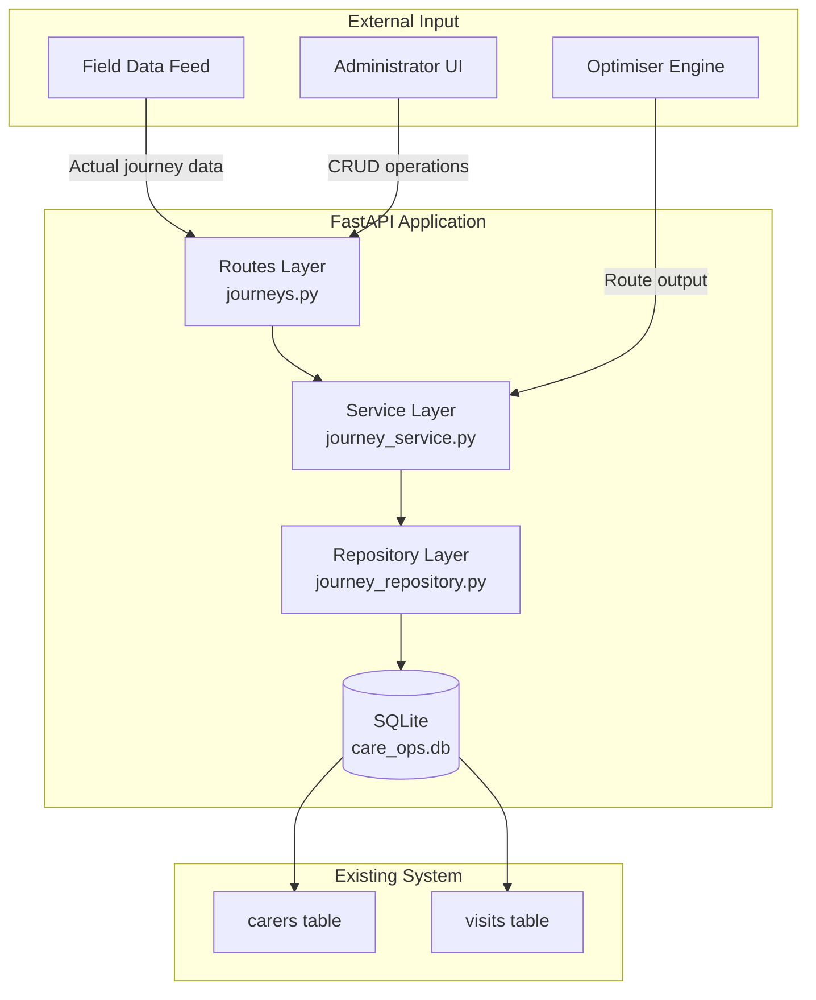
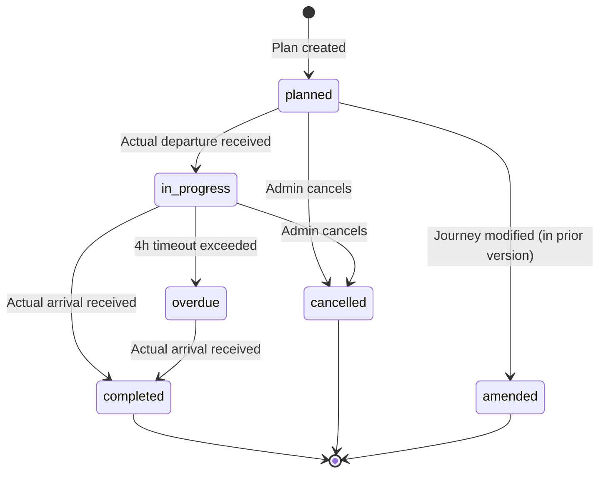

# Design Document: Journey Lifecycle Management

## Overview

The Journey Lifecycle Management feature adds temporal state tracking to the existing care route optimisation system. It introduces a set of database tables and a service layer that manages the full lifecycle of carer journeys — from plan creation through real-time tracking to historical comparison.

The system builds on the existing optimiser output (routes and assignments) by converting them into versioned, stateful journey plans that can be tracked against actual field data. This enables operations staff to see what was planned, what actually happened, and where variances occurred.

### Key Design Decisions

1. **Append-only versioning** — Plan modifications never overwrite existing data. Each change creates a new Plan_Version, preserving full audit history.
2. **Soft-delete with archive** — Deleted plans are marked with a deletion timestamp rather than removed, supporting archive queries.
3. **Matching heuristic for actuals** — Actual journey data is matched to planned journeys using carer ID + operating day + departure time proximity (60-minute window).
4. **Existing patterns preserved** — The design follows the established repository pattern (async functions with `get_db()`), Pydantic models, and FastAPI router structure already in the codebase.

## Architecture



### Layer Responsibilities

- **Routes** (`backend/app/routes/journeys.py`): HTTP endpoint definitions, request validation, response formatting
- **Service** (`backend/app/services/journey_service.py`): Business logic — state machine transitions, matching algorithm, variance calculations, validation rules
- **Repository** (`backend/app/db/journey_repository.py`): Raw database operations — SQL queries, row-to-model mapping

## Components and Interfaces

### API Endpoints

| Method | Path | Description |
|--------|------|-------------|
| POST | `/api/journey-plans` | Create a new journey plan |
| GET | `/api/journey-plans` | List journey plans (with filters) |
| GET | `/api/journey-plans/{plan_id}` | Get a specific plan with journeys |
| PUT | `/api/journey-plans/{plan_id}/journeys/{journey_id}` | Modify a journey |
| DELETE | `/api/journey-plans/{plan_id}` | Delete (archive) a journey plan |
| POST | `/api/journeys/{journey_id}/cancel` | Cancel a journey |
| POST | `/api/actual-journeys` | Receive actual journey data |
| GET | `/api/journey-comparison/{operating_day}` | Plan vs actual comparison |
| GET | `/api/journey-history/{operating_day}` | Historical plan versions |
| GET | `/api/journey-history` | Date range summary |
| GET | `/api/journeys` | Query/filter journeys |

### Service Layer Interface

```python
class JourneyService:
    async def create_plan(self, operating_day: date, journeys: list[JourneyCreate], 
                          reason: PlanCreationReason) -> JourneyPlanModel
    async def create_plan_from_optimiser(self, operating_day: date, 
                                          routes: list[RouteModel]) -> JourneyPlanModel
    async def modify_journey(self, plan_id: int, journey_id: int, 
                             update: JourneyUpdate) -> JourneyPlanModel
    async def delete_plan(self, plan_id: int) -> DeleteConfirmation
    async def cancel_journey(self, journey_id: int) -> JourneyModel
    async def receive_actual(self, data: ActualJourneyCreate) -> ActualJourneyModel
    async def get_comparison(self, operating_day: date, 
                             plan_version: int | None = None) -> ComparisonResult
    async def get_history(self, operating_day: date) -> list[JourneyPlanModel]
    async def get_date_range_summary(self, start: date, end: date) -> list[DaySummary]
    async def query_journeys(self, filters: JourneyFilters, 
                             page: int, page_size: int) -> PaginatedResult
```

### Journey State Machine



### State Transition Rules

| Current State | Allowed Transitions | Trigger |
|---------------|-------------------|---------|
| `planned` | `in_progress`, `cancelled`, `amended` | Departure data, cancel request, modification |
| `in_progress` | `completed`, `cancelled`, `overdue` | Arrival data, cancel request, 4h timeout |
| `overdue` | `completed` | Late arrival data |
| `completed` | — (terminal) | — |
| `cancelled` | — (terminal) | — |
| `amended` | — (terminal) | — |

## Data Models

### Database Schema Extensions

```sql
CREATE TABLE IF NOT EXISTS journey_plans (
    id INTEGER PRIMARY KEY AUTOINCREMENT,
    operating_day TEXT NOT NULL,           -- YYYY-MM-DD
    plan_version INTEGER NOT NULL DEFAULT 1,
    creation_reason TEXT NOT NULL CHECK(creation_reason IN ('initial_creation', 'manual_amendment', 're_optimisation')),
    is_archived INTEGER NOT NULL DEFAULT 0,
    archived_at TEXT,                       -- UTC ISO 8601
    created_at TEXT NOT NULL DEFAULT (datetime('now')),
    UNIQUE(operating_day, plan_version)
);

CREATE TABLE IF NOT EXISTS journeys (
    id INTEGER PRIMARY KEY AUTOINCREMENT,
    plan_id INTEGER NOT NULL REFERENCES journey_plans(id),
    carer_id INTEGER NOT NULL REFERENCES carers(id),
    visit_id INTEGER REFERENCES visits(id),  -- NULL for home-to-first and last-to-home legs
    origin_lat REAL NOT NULL,
    origin_lng REAL NOT NULL,
    origin_label TEXT,                       -- Human-readable origin name
    destination_lat REAL NOT NULL,
    destination_lng REAL NOT NULL,
    destination_label TEXT,                  -- Human-readable destination name
    planned_departure TEXT NOT NULL,          -- ISO 8601 datetime
    planned_arrival TEXT NOT NULL,            -- ISO 8601 datetime
    planned_distance_miles REAL NOT NULL,
    status TEXT NOT NULL DEFAULT 'planned' CHECK(status IN ('planned', 'in_progress', 'completed', 'cancelled', 'amended', 'overdue')),
    cancelled_at TEXT,                       -- UTC ISO 8601
    created_at TEXT NOT NULL DEFAULT (datetime('now')),
    updated_at TEXT NOT NULL DEFAULT (datetime('now'))
);

CREATE TABLE IF NOT EXISTS actual_journeys (
    id INTEGER PRIMARY KEY AUTOINCREMENT,
    journey_id INTEGER REFERENCES journeys(id),  -- NULL for unmatched
    carer_id INTEGER NOT NULL REFERENCES carers(id),
    operating_day TEXT NOT NULL,              -- YYYY-MM-DD
    actual_departure TEXT NOT NULL,           -- ISO 8601 datetime
    actual_arrival TEXT NOT NULL,             -- ISO 8601 datetime
    actual_distance_miles REAL NOT NULL,      -- 1 decimal place
    route_coordinates TEXT NOT NULL DEFAULT '[]',  -- JSON array of [lat, lng] pairs, max 1000
    match_status TEXT NOT NULL DEFAULT 'matched' CHECK(match_status IN ('matched', 'unmatched')),
    created_at TEXT NOT NULL DEFAULT (datetime('now'))
);

CREATE INDEX IF NOT EXISTS idx_journey_plans_operating_day ON journey_plans(operating_day);
CREATE INDEX IF NOT EXISTS idx_journeys_plan_id ON journeys(plan_id);
CREATE INDEX IF NOT EXISTS idx_journeys_carer_id ON journeys(carer_id);
CREATE INDEX IF NOT EXISTS idx_journeys_status ON journeys(status);
CREATE INDEX IF NOT EXISTS idx_actual_journeys_operating_day ON actual_journeys(operating_day);
CREATE INDEX IF NOT EXISTS idx_actual_journeys_carer_id ON actual_journeys(carer_id);
```

### Pydantic Models

```python
from datetime import date, datetime
from enum import Enum
from typing import Optional
from pydantic import BaseModel, Field


class JourneyStatus(str, Enum):
    PLANNED = "planned"
    IN_PROGRESS = "in_progress"
    COMPLETED = "completed"
    CANCELLED = "cancelled"
    AMENDED = "amended"
    OVERDUE = "overdue"


class PlanCreationReason(str, Enum):
    INITIAL_CREATION = "initial_creation"
    MANUAL_AMENDMENT = "manual_amendment"
    RE_OPTIMISATION = "re_optimisation"


class MatchStatus(str, Enum):
    MATCHED = "matched"
    UNMATCHED = "unmatched"
    UNSTARTED = "unstarted"
    UNPLANNED = "unplanned"


class JourneyCreate(BaseModel):
    carer_id: int
    visit_id: Optional[int] = None
    origin_lat: float
    origin_lng: float
    origin_label: Optional[str] = None
    destination_lat: float
    destination_lng: float
    destination_label: Optional[str] = None
    planned_departure: datetime
    planned_arrival: datetime
    planned_distance_miles: float


class JourneyUpdate(BaseModel):
    carer_id: Optional[int] = None
    planned_departure: Optional[datetime] = None
    planned_arrival: Optional[datetime] = None
    origin_lat: Optional[float] = None
    origin_lng: Optional[float] = None
    destination_lat: Optional[float] = None
    destination_lng: Optional[float] = None


class JourneyModel(BaseModel):
    id: int
    plan_id: int
    carer_id: int
    visit_id: Optional[int] = None
    origin_lat: float
    origin_lng: float
    origin_label: Optional[str] = None
    destination_lat: float
    destination_lng: float
    destination_label: Optional[str] = None
    planned_departure: str
    planned_arrival: str
    planned_distance_miles: float
    status: JourneyStatus
    cancelled_at: Optional[str] = None
    created_at: str
    updated_at: str


class JourneyPlanModel(BaseModel):
    id: int
    operating_day: str
    plan_version: int
    creation_reason: PlanCreationReason
    is_archived: bool
    archived_at: Optional[str] = None
    created_at: str
    journeys: list[JourneyModel] = []


class ActualJourneyCreate(BaseModel):
    carer_id: int
    operating_day: date
    actual_departure: datetime
    actual_arrival: datetime
    actual_distance_miles: float = Field(ge=0)
    route_coordinates: list[list[float]] = Field(default_factory=list, max_length=1000)


class ActualJourneyModel(BaseModel):
    id: int
    journey_id: Optional[int] = None
    carer_id: int
    operating_day: str
    actual_departure: str
    actual_arrival: str
    actual_distance_miles: float
    route_coordinates: list[list[float]]
    match_status: MatchStatus
    created_at: str


class VarianceModel(BaseModel):
    departure_variance_minutes: Optional[int] = None  # positive = late
    arrival_variance_minutes: Optional[int] = None    # positive = late
    distance_variance_miles: Optional[float] = None   # positive = longer


class ComparisonEntry(BaseModel):
    planned_journey: Optional[JourneyModel] = None
    actual_journey: Optional[ActualJourneyModel] = None
    variance: Optional[VarianceModel] = None
    match_status: MatchStatus


class ComparisonResult(BaseModel):
    operating_day: str
    plan_version: int
    entries_by_carer: dict[int, list[ComparisonEntry]]  # carer_id -> entries
    message: Optional[str] = None


class DaySummary(BaseModel):
    operating_day: str
    plan_version_count: int
    total_planned_journeys: int
    total_completed_journeys: int
    avg_departure_variance_minutes: Optional[float] = None
    avg_distance_variance_miles: Optional[float] = None


class JourneyFilters(BaseModel):
    operating_day: Optional[date] = None
    carer_id: Optional[int] = None
    status: Optional[JourneyStatus] = None


class PaginatedResult(BaseModel):
    total_count: int
    page: int
    page_size: int
    journeys: list[JourneyModel]


class DeleteConfirmation(BaseModel):
    plan_id: int
    journeys_removed: int
```

## Correctness Properties

*A property is a characteristic or behavior that should hold true across all valid executions of a system — essentially, a formal statement about what the system should do. Properties serve as the bridge between human-readable specifications and machine-verifiable correctness guarantees.*

### Property 1: Journey plan creation round-trip

*For any* valid journey plan data (operating day, list of journeys with carer ID, origin, destination, departure, arrival, distance, and visit ID), creating the plan and then retrieving it should produce an equivalent record containing all original fields, a unique identifier, plan version 1, and a creation timestamp.

**Validates: Requirements 1.1, 1.5**

### Property 2: Optimiser route conversion produces ordered planned journeys

*For any* valid list of RouteModel outputs from the optimiser, converting them to a journey plan should produce journeys ordered by planned departure time within each carer's route, with all Journey_Status values set to `planned`.

**Validates: Requirements 1.2**

### Property 3: Operating day date validation

*For any* date, the system should accept journey plan creation if and only if the date is today or a future date within 365 days from today. All other dates (past dates or dates beyond 365 days) should be rejected with an appropriate error.

**Validates: Requirements 1.3, 1.4**

### Property 4: Plan versioning increments sequentially

*For any* operating day, creating N journey plans for that same day should produce plan versions numbered 1 through N consecutively, with all prior versions retained and unchanged.

**Validates: Requirements 1.6, 6.1**

### Property 5: Modifications always create new versions preserving prior state

*For any* journey modification or cancellation, the system should create a new Plan_Version and the previous Plan_Version's data should remain completely unchanged. The modified journey in the prior version should have status `amended`.

**Validates: Requirements 2.1, 2.6, 7.6**

### Property 6: Planned journey field editability

*For any* journey with status `planned`, updates to carer ID, departure time, arrival time, origin location, and destination location should all succeed and be reflected in the new plan version.

**Validates: Requirements 2.2**

### Property 7: In-progress journey restricts editable fields

*For any* journey with status `in_progress`, only updates to planned arrival time and destination location should succeed. Updates to any other field (carer ID, departure time, origin) should be rejected.

**Validates: Requirements 2.3**

### Property 8: Terminal states reject modification

*For any* journey with status `completed` or `cancelled`, and *for any* update payload, the modification should be rejected with an appropriate error message.

**Validates: Requirements 2.4, 2.5**

### Property 9: Deletion guard — no active journeys

*For any* journey plan for a future date where at least one journey has status `in_progress` or `completed`, deletion should be rejected and the error response should list the journey identifiers that prevent deletion.

**Validates: Requirements 3.2**

### Property 10: Soft-delete archives with timestamp

*For any* successfully deleted journey plan, the plan should be marked as archived with a non-null `archived_at` UTC timestamp and should no longer appear in standard list/search operations, but should be retrievable via archive-specific queries.

**Validates: Requirements 3.1, 3.3**

### Property 11: Actual journey data persistence round-trip

*For any* valid actual journey data (carer ID, departure/arrival times, distance to 1 decimal, route coordinates ≤1000 pairs), storing the data and retrieving it should produce an equivalent record with all fields preserved.

**Validates: Requirements 4.1**

### Property 12: State transition — departure triggers in_progress

*For any* journey with status `planned`, receiving actual departure data should transition the journey status to `in_progress`.

**Validates: Requirements 4.2**

### Property 13: State transition — arrival triggers completed

*For any* journey with status `in_progress`, receiving actual arrival data should transition the journey status to `completed`.

**Validates: Requirements 4.3**

### Property 14: Actual journey validation rejects invalid data

*For any* actual journey submission where the actual arrival time is not strictly later than the actual departure time, or where required fields are missing, the system should reject the data with validation errors identifying each invalid field.

**Validates: Requirements 4.5**

### Property 15: Actual journey matching selects closest planned departure

*For any* actual journey with multiple candidate planned journeys within the 60-minute departure window (same carer, same operating day), the system should match to the planned journey with the closest departure time to the actual departure time.

**Validates: Requirements 4.6**

### Property 16: Variance calculation correctness

*For any* matched pair of planned and actual journey data, the departure variance should equal `(actual_departure - planned_departure)` in whole minutes (signed), the arrival variance should equal `(actual_arrival - planned_arrival)` in whole minutes (signed), and the distance variance should equal `(actual_distance - planned_distance)` rounded to 1 decimal place (signed).

**Validates: Requirements 5.2, 5.3, 5.4**

### Property 17: Comparison includes unmatched entries with null variances

*For any* comparison result, planned journeys without matching actuals should appear with match_status `unstarted` and all variance values null. Actual journeys without matching planned journeys should appear with match_status `unplanned` and all variance values null.

**Validates: Requirements 5.5**

### Property 18: Comparison results grouped by carer and ordered by departure

*For any* comparison for an operating day, the results should be grouped by carer ID and within each carer group, entries should be ordered by planned departure time ascending.

**Validates: Requirements 5.1**

### Property 19: History returns versions in chronological order

*For any* operating day with multiple plan versions, requesting history should return all versions ordered by creation timestamp ascending, including version number, creation reason, and the full set of journeys for each version.

**Validates: Requirements 6.3**

### Property 20: Date range validation for historical queries

*For any* date range request where the range exceeds 90 days or where the start date is after the end date, the system should reject the request with an error identifying which constraint was violated.

**Validates: Requirements 6.6**

### Property 21: Cancellation of planned journey

*For any* journey with status `planned`, cancellation should set status to `cancelled` and record a valid UTC ISO 8601 cancellation timestamp.

**Validates: Requirements 7.1**

### Property 22: Cancellation of in-progress journey unassigns visits

*For any* journey with status `in_progress`, cancellation should set status to `cancelled`, record a UTC ISO 8601 timestamp, and mark all incomplete visits within the journey as unassigned.

**Validates: Requirements 7.2**

### Property 23: Terminal states reject cancellation

*For any* journey with status `completed` or `cancelled`, attempting cancellation should be rejected — `completed` because it cannot be undone, `cancelled` because it is already cancelled.

**Validates: Requirements 7.3, 7.4**

### Property 24: Query filter intersection semantics

*For any* combination of query filters (operating_day, carer_id, status), all returned journeys should satisfy every specified filter simultaneously. Results should come from the latest Plan_Version for each relevant operating day.

**Validates: Requirements 8.3, 8.4**

### Property 25: Carer query ordering

*For any* carer with journeys across multiple operating days, querying by carer ID should return journeys ordered by planned departure time descending, using the latest plan version for each day.

**Validates: Requirements 8.2**

### Property 26: Pagination correctness

*For any* query result set of size N, requesting page P with page_size S should return exactly `min(S, N - (P-1)*S)` results (or 0 if `(P-1)*S >= N`), and total_count should always equal N regardless of page/page_size values.

**Validates: Requirements 8.5**

### Property 27: Invalid filter rejection

*For any* query containing an invalid filter value (non-existent carer ID, status not in the defined enum, or malformed date), the system should reject the query with an error identifying which filter parameter is invalid.

**Validates: Requirements 8.6**

## Error Handling

### Validation Errors (HTTP 422)

- Invalid operating day (past date, >365 days future, malformed format)
- Invalid journey data (missing required fields, arrival ≤ departure)
- Invalid filter parameters (unknown status, non-existent carer ID)
- Date range violations (>90 days, start > end)
- Page/page_size out of bounds (page < 1, page_size < 1 or > 100)
- Route coordinates exceeding 1000 pairs

### Business Logic Errors (HTTP 409 Conflict)

- Attempting to modify a journey in terminal state (`completed`, `cancelled`)
- Attempting to delete a plan with active journeys (`in_progress`, `completed`)
- Attempting to delete the only plan for today's operating day
- Attempting to cancel a journey in terminal state
- Attempting to modify restricted fields on `in_progress` journeys

### Not Found Errors (HTTP 404)

- Journey plan ID does not exist
- Journey ID does not exist
- Carer ID does not exist (when receiving actuals)

### Error Response Format

```python
class ErrorResponse(BaseModel):
    error: str           # Machine-readable error code
    message: str         # Human-readable description
    details: dict = {}   # Additional context (e.g., invalid field names, blocking journey IDs)
```

All errors follow the existing FastAPI exception handler pattern using `HTTPException` with appropriate status codes.

## Testing Strategy

### Property-Based Testing (Hypothesis)

The project already includes `hypothesis==6.156.6` in requirements. Property-based tests will be implemented using Hypothesis to verify the correctness properties defined above.

**Configuration:**
- Minimum 100 examples per property test (`@settings(max_examples=100)`)
- Each test tagged with: `# Feature: journey-lifecycle-management, Property {N}: {title}`
- Tests located in `backend/tests/test_journey_properties.py`

**Key generators needed:**
- `st_operating_day()` — generates valid future dates within 365 days
- `st_journey_create()` — generates valid JourneyCreate payloads
- `st_journey_update()` — generates valid partial update payloads
- `st_actual_journey()` — generates valid ActualJourneyCreate payloads
- `st_journey_status()` — generates JourneyStatus enum values
- `st_route_coordinates()` — generates lists of [lat, lng] pairs (0-1000 items)

**Property test categories:**
- Round-trip properties (1, 4, 11): verify data persistence integrity
- State machine properties (5, 6, 7, 8, 12, 13, 21, 22, 23): verify transition rules
- Calculation properties (16): verify variance arithmetic
- Ordering/grouping properties (2, 18, 19, 25): verify sorting invariants
- Validation properties (3, 14, 20, 27): verify rejection of invalid input
- Filter properties (9, 10, 17, 24, 26): verify query semantics

### Unit Tests (pytest)

Example-based tests for specific scenarios:
- Unmatched actual journey creates exception list entry (Req 4.4)
- 4-hour timeout flags journey as overdue (Req 4.7)
- Empty comparison returns appropriate message (Req 5.6)
- Specific plan version comparison (Req 5.7)
- Deletion of non-existent plan returns 404 (Req 3.6)
- Deletion of today's only plan rejected (Req 3.4)
- Empty query results return count 0 (Req 8.7)

### Integration Tests

- End-to-end flow: create plan → receive actuals → compare
- Optimiser output integration: run optimiser → convert to journey plan
- Concurrent plan version creation
- Archive query retrieval after deletion

### Test File Structure

```
backend/tests/
├── test_journey_properties.py     # Property-based tests (27 properties)
├── test_journey_service.py        # Unit tests for service layer
├── test_journey_repository.py     # Repository layer tests
└── test_routes_journeys.py        # API endpoint integration tests
```

