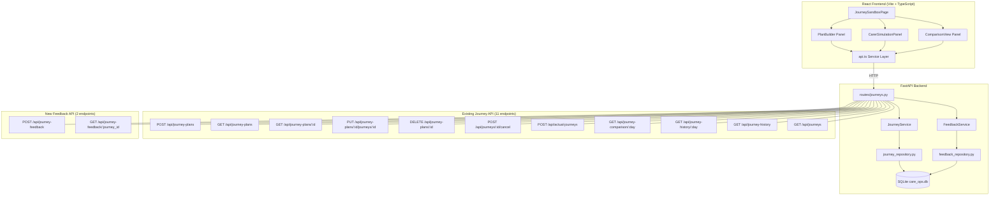

# Design Document: Journey Sandbox Testing

## Overview

The Journey Sandbox Testing feature adds an interactive testing page to the WinServeCare admin dashboard that lets administrators exercise all 11 journey lifecycle API endpoints visually, along with a new route feedback endpoint. It consists of three frontend panels (Plan Builder, Carer Simulation, Comparison View) and a new backend API endpoint for carer route feedback.

### Key Design Decisions

1. **Live database, not mocked** — The sandbox operates against real API endpoints and the existing database. A visible banner warns the administrator, and a "Reset Test Data" button provides controlled cleanup.
2. **Single-page three-panel layout** — All sandbox functionality lives on one page with three collapsible/stackable panels, reducing context switching during testing workflows.
3. **New feedback endpoint co-located with existing journey routes** — The `POST/GET /api/journey-feedback` endpoint is added to the existing `routes/journeys.py` router and uses the existing `JourneyService` for validation (journey existence and status checks).
4. **Mobile-first carer simulation** — The Carer Simulation Panel is designed responsive-first for 480px viewports with touch-friendly controls, enabling real device testing.
5. **Existing patterns preserved** — The design follows the established repository pattern (async functions, `get_db()`), Pydantic models, axios-based frontend API service, and React Router page structure already in the codebase.

## Architecture



### Layer Responsibilities

| Layer | File(s) | Responsibility |
|-------|---------|----------------|
| Page | `frontend/src/pages/JourneySandboxPage.tsx` | Layout, panel orchestration, shared state |
| Plan Builder | `frontend/src/components/sandbox/PlanBuilder.tsx` | Plan CRUD form, journey table, version history |
| Carer Simulation | `frontend/src/components/sandbox/CarerSimulationPanel.tsx` | Actual journey submission, feedback, quick-submit |
| Comparison View | `frontend/src/components/sandbox/ComparisonView.tsx` | Side-by-side planned vs actual display |
| Status Timeline | `frontend/src/components/sandbox/StatusTimeline.tsx` | Journey state transition visualisation |
| API Functions | `frontend/src/services/api.ts` (extended) | New feedback API calls + journey sandbox helpers |
| Routes (Backend) | `backend/app/routes/journeys.py` (extended) | Feedback endpoint definitions |
| Service (Backend) | `backend/app/services/feedback_service.py` | Feedback validation and persistence logic |
| Repository (Backend) | `backend/app/db/feedback_repository.py` | SQL operations for journey_feedback table |
| Models (Backend) | `backend/app/models/journey.py` (extended) | Feedback Pydantic models |

## Components and Interfaces

### New API Endpoints

| Method | Path | Description |
|--------|------|-------------|
| POST | `/api/journey-feedback` | Submit route feedback for a completed journey |
| GET | `/api/journey-feedback/{journey_id}` | Retrieve feedback for a specific journey |

### POST /api/journey-feedback

**Request Body:**
```json
{
  "journey_id": 42,
  "carer_id": 7,
  "rating": "thumbs_up",
  "comment": "Route was efficient, no traffic issues",
  "submitted_at": "2026-07-20T14:30:00Z"
}
```

**Response (201 Created):**
```json
{
  "id": 1,
  "journey_id": 42,
  "carer_id": 7,
  "rating": "thumbs_up",
  "comment": "Route was efficient, no traffic issues",
  "submitted_at": "2026-07-20T14:30:00Z",
  "created_at": "2026-07-20T14:30:05Z"
}
```

**Error Responses:**
- `422` — Journey does not exist or is not in `completed` status
- `409` — Feedback already exists for this journey from this carer

### GET /api/journey-feedback/{journey_id}

**Response (200 OK):**
```json
{
  "id": 1,
  "journey_id": 42,
  "carer_id": 7,
  "rating": "thumbs_up",
  "comment": "Route was efficient, no traffic issues",
  "submitted_at": "2026-07-20T14:30:00Z",
  "created_at": "2026-07-20T14:30:05Z"
}
```

**Error Responses:**
- `404` — No feedback found for this journey

### Frontend Component Interfaces

```typescript
// PlanBuilder props
interface PlanBuilderProps {
  onPlanCreated: (plan: JourneyPlan) => void;
  onJourneySelected: (journey: Journey) => void;
}

// CarerSimulationPanel props
interface CarerSimulationPanelProps {
  onActualSubmitted: (actual: ActualJourney) => void;
  onFeedbackSubmitted: (feedback: JourneyFeedback) => void;
}

// ComparisonView props
interface ComparisonViewProps {
  onJourneySelected: (journey: Journey) => void;
}

// StatusTimeline props
interface StatusTimelineProps {
  journeyId: number;
  isOpen: boolean;
  onClose: () => void;
}
```

### Frontend API Service Extensions

```typescript
// Journey Sandbox API functions (added to api.ts)

// Feedback
export const submitJourneyFeedback = (data: JourneyFeedbackCreate) =>
  api.post('/journey-feedback', data).then((r) => r.data);

export const getJourneyFeedback = (journeyId: number) =>
  api.get(`/journey-feedback/${journeyId}`).then((r) => r.data);

// Journey Plans (wrapping existing endpoints for sandbox)
export const createJourneyPlan = (data: JourneyPlanCreate) =>
  api.post('/journey-plans', data).then((r) => r.data);

export const listJourneyPlans = (params?: { operatingDay?: string; includeArchived?: boolean }) =>
  api.get('/journey-plans', { params }).then((r) => r.data);

export const getJourneyPlan = (planId: number) =>
  api.get(`/journey-plans/${planId}`).then((r) => r.data);

export const modifyJourney = (planId: number, journeyId: number, update: JourneyUpdate) =>
  api.put(`/journey-plans/${planId}/journeys/${journeyId}`, update).then((r) => r.data);

export const deleteJourneyPlan = (planId: number) =>
  api.delete(`/journey-plans/${planId}`).then((r) => r.data);

export const cancelJourney = (journeyId: number) =>
  api.post(`/journeys/${journeyId}/cancel`).then((r) => r.data);

export const submitActualJourney = (data: ActualJourneyCreate) =>
  api.post('/actual-journeys', data).then((r) => r.data);

export const getJourneyComparison = (operatingDay: string, planVersion?: number) =>
  api.get(`/journey-comparison/${operatingDay}`, { params: planVersion ? { plan_version: planVersion } : {} }).then((r) => r.data);

export const getJourneyHistory = (operatingDay: string) =>
  api.get(`/journey-history/${operatingDay}`).then((r) => r.data);

export const getJourneyHistoryRange = (start: string, end: string) =>
  api.get('/journey-history', { params: { start, end } }).then((r) => r.data);

export const queryJourneys = (params: JourneyQueryParams) =>
  api.get('/journeys', { params }).then((r) => r.data);
```

### Backend Service Interface

```python
class FeedbackService:
    async def submit_feedback(self, data: JourneyFeedbackCreate) -> JourneyFeedbackModel:
        """Validate journey eligibility and persist feedback."""
        ...

    async def get_feedback(self, journey_id: int) -> JourneyFeedbackModel | None:
        """Retrieve feedback for a specific journey."""
        ...
```

## Data Models

### New Database Table

```sql
CREATE TABLE IF NOT EXISTS journey_feedback (
    id INTEGER PRIMARY KEY AUTOINCREMENT,
    journey_id INTEGER NOT NULL REFERENCES journeys(id),
    carer_id INTEGER NOT NULL REFERENCES carers(id),
    rating TEXT NOT NULL CHECK(rating IN ('thumbs_up', 'neutral', 'thumbs_down')),
    comment TEXT,                              -- Max 300 characters, enforced at app layer
    submitted_at TEXT NOT NULL,                -- UTC ISO 8601
    created_at TEXT NOT NULL DEFAULT (datetime('now')),
    UNIQUE(journey_id, carer_id)              -- One feedback per journey per carer
);

CREATE INDEX IF NOT EXISTS idx_journey_feedback_journey ON journey_feedback(journey_id);
CREATE INDEX IF NOT EXISTS idx_journey_feedback_carer ON journey_feedback(carer_id);
```

### New Pydantic Models (added to `backend/app/models/journey.py`)

```python
class FeedbackRating(str, Enum):
    """Route quality feedback rating."""
    THUMBS_UP = "thumbs_up"
    NEUTRAL = "neutral"
    THUMBS_DOWN = "thumbs_down"


class JourneyFeedbackCreate(BaseModel):
    """Payload for submitting route feedback."""
    journey_id: int
    carer_id: int
    rating: FeedbackRating
    comment: Optional[str] = Field(None, max_length=300)
    submitted_at: datetime


class JourneyFeedbackModel(BaseModel):
    """Full feedback record returned from API."""
    id: int
    journey_id: int
    carer_id: int
    rating: FeedbackRating
    comment: Optional[str] = None
    submitted_at: str
    created_at: str
```

### Frontend TypeScript Types (new file: `frontend/src/types/sandbox.ts`)

```typescript
export type FeedbackRating = 'thumbs_up' | 'neutral' | 'thumbs_down';

export interface JourneyFeedbackCreate {
  journeyId: number;
  carerId: number;
  rating: FeedbackRating;
  comment?: string;
  submittedAt: string; // ISO 8601 UTC
}

export interface JourneyFeedback {
  id: number;
  journeyId: number;
  carerId: number;
  rating: FeedbackRating;
  comment?: string;
  submittedAt: string;
  createdAt: string;
}

export interface JourneyPlanCreate {
  operatingDay: string; // YYYY-MM-DD
  journeys: JourneyCreateEntry[];
  reason?: 'initial_creation' | 'manual_amendment' | 're_optimisation';
}

export interface JourneyCreateEntry {
  carerId: number;
  visitId?: number;
  originLat: number;
  originLng: number;
  originLabel?: string;
  destinationLat: number;
  destinationLng: number;
  destinationLabel?: string;
  plannedDeparture: string;
  plannedArrival: string;
  plannedDistanceMiles: number;
}

export interface JourneyUpdate {
  carerId?: number;
  plannedDeparture?: string;
  plannedArrival?: string;
  originLat?: number;
  originLng?: number;
  destinationLat?: number;
  destinationLng?: number;
}

export interface ActualJourneyCreate {
  carerId: number;
  operatingDay: string;
  actualDeparture: string;
  actualArrival: string;
  actualDistanceMiles: number;
  routeCoordinates?: number[][];
}

export interface JourneyQueryParams {
  operatingDay?: string;
  carerId?: number;
  status?: string;
  page?: number;
  pageSize?: number;
}

export interface QuickSubmitConfig {
  carerId: number;
  operatingDay: string;
}
```


## Correctness Properties

*A property is a characteristic or behavior that should hold true across all valid executions of a system — essentially, a formal statement about what the system should do. Properties serve as the bridge between human-readable specifications and machine-verifiable correctness guarantees.*

### Property 1: Operating Day Validation

*For any* date value, the Plan Builder's date validation function SHALL accept the date if and only if it is today or a future date. All past dates SHALL be rejected with an inline validation error.

**Validates: Requirements 3.2**

### Property 2: Departure-Arrival Time Ordering

*For any* pair of planned departure and planned arrival datetime values in a journey entry, the Plan Builder's time validation function SHALL accept the pair if and only if the arrival time is strictly after the departure time. Pairs where arrival is equal to or before departure SHALL be rejected with an inline error.

**Validates: Requirements 3.3**

### Property 3: Quick Submit Data Bounds

*For any* invocation of the Quick Submit random data generator, the generated actual departure SHALL be within 30 minutes of the current time, the generated actual arrival SHALL be between 15 and 60 minutes after the departure, and the generated distance SHALL be between 1 and 20 miles inclusive.

**Validates: Requirements 4.5**

### Property 4: Comment Length Validation

*For any* string submitted as a route feedback comment, the system SHALL accept the comment if its length is 300 characters or fewer, and SHALL reject or prevent submission of comments exceeding 300 characters.

**Validates: Requirements 5.2, 10.1**

### Property 5: Variance Colour Coding

*For any* departure variance value in minutes, the Comparison View SHALL render the value with a green colour indicator when the variance is zero or negative (on-time or early), and with a red colour indicator when the variance is positive (late).

**Validates: Requirements 6.2**

### Property 6: Status Timeline Completeness and Colour Mapping

*For any* list of journey status transitions, the Status Timeline component SHALL render each transition with all four required fields (previous status, new status, timestamp, trigger source), and SHALL apply the correct colour to each status badge: blue for planned, yellow for in_progress, green for completed, red for cancelled, orange for overdue, and grey for amended.

**Validates: Requirements 7.2, 7.4**

### Property 7: Feedback API Payload Validation

*For any* feedback submission payload, the Journey API SHALL accept the request if and only if: the journey_id references an existing journey, the rating is one of `thumbs_up`, `neutral`, or `thumbs_down`, and the comment (if provided) is 300 characters or fewer. Invalid payloads SHALL be rejected with a 422 status code identifying the invalid fields.

**Validates: Requirements 10.1, 10.2**

### Property 8: Completed-Only Feedback Eligibility

*For any* journey and *for any* feedback submission targeting that journey, the Journey API SHALL accept the feedback if and only if the journey's current status is `completed`. Journeys with any other status (planned, in_progress, cancelled, amended, overdue) SHALL be rejected with a 422 error indicating the journey is not eligible for feedback.

**Validates: Requirements 10.2**

### Property 9: Feedback Persistence Round-Trip

*For any* valid feedback submission (valid journey_id referencing a completed journey, valid rating, comment ≤ 300 characters, and valid UTC timestamp), POSTing the feedback and then GETting it by journey_id SHALL return a record with all original fields preserved: journey_id, carer_id, rating, comment, and submitted_at.

**Validates: Requirements 10.3, 10.4**

### Property 10: Duplicate Feedback Rejection

*For any* journey_id and carer_id pair, after a successful feedback submission, any subsequent submission with the same journey_id and carer_id SHALL be rejected with a 409 Conflict status code, regardless of the rating or comment values in the duplicate submission.

**Validates: Requirements 10.5**

## Error Handling

### Frontend Error Handling

| Error Scenario | Panel | Behaviour |
|----------------|-------|-----------|
| API returns 4xx/5xx on plan creation | Plan Builder | Display error message in alert banner within panel; preserve form data |
| API returns 4xx on actual journey submit | Carer Simulation | Display inline field-level errors next to corresponding inputs |
| API returns 422 on feedback submit | Carer Simulation | Display error message explaining ineligibility (journey not completed) |
| API returns 409 on feedback submit | Carer Simulation | Display message "Feedback already submitted for this journey" |
| API returns 404 on plan fetch | Plan Builder | Remove plan from list, show "Plan not found" toast |
| Network timeout / connection failure | All panels | Display "Connection error – please check your network" banner |
| API returns 409 on plan delete (active journeys) | Plan Builder | Display blocking journey IDs in error alert |
| Reset operation fails | Sandbox banner | Display error details and list of blocking journey IDs |

### Backend Error Handling (Feedback Endpoint)

| Status Code | Condition | Response Body |
|-------------|-----------|---------------|
| 201 | Feedback created successfully | `JourneyFeedbackModel` |
| 404 | GET feedback for journey with no feedback | `{"error": "not_found", "message": "No feedback found for journey {id}"}` |
| 409 | Duplicate feedback (same journey + carer) | `{"error": "duplicate_feedback", "message": "Feedback already exists for journey {id} from carer {carer_id}"}` |
| 422 | Journey does not exist | `{"error": "journey_not_found", "message": "Journey {id} does not exist"}` |
| 422 | Journey not in completed status | `{"error": "journey_not_eligible", "message": "Journey {id} has status '{status}', feedback requires 'completed' status"}` |
| 422 | Comment exceeds 300 characters | `{"error": "validation_error", "message": "Comment must not exceed 300 characters"}` |
| 422 | Invalid rating value | `{"error": "validation_error", "message": "Rating must be one of: thumbs_up, neutral, thumbs_down"}` |

## Testing Strategy

### Property-Based Testing (Hypothesis — Backend)

The project already uses `hypothesis==6.156.6`. Property-based tests will verify the backend feedback endpoint correctness properties.

**Configuration:**
- Minimum 100 examples per property test (`@settings(max_examples=100)`)
- Each test tagged with: `# Feature: journey-sandbox-testing, Property {N}: {title}`
- Tests located in `backend/tests/test_feedback_properties.py`

**Key generators needed:**
- `st_feedback_rating()` — generates valid FeedbackRating enum values
- `st_comment()` — generates optional strings 0–300 characters
- `st_invalid_comment()` — generates strings > 300 characters
- `st_journey_status()` — generates JourneyStatus enum values
- `st_feedback_create()` — generates valid JourneyFeedbackCreate payloads
- `st_utc_timestamp()` — generates valid UTC datetime strings

**Property test mapping:**
| Property | Test |
|----------|------|
| Property 7: Feedback API Payload Validation | Test that valid payloads are accepted and invalid payloads (bad rating, long comment) are rejected |
| Property 8: Completed-Only Feedback Eligibility | Test that only completed journeys accept feedback |
| Property 9: Feedback Persistence Round-Trip | Test POST then GET returns equivalent record |
| Property 10: Duplicate Feedback Rejection | Test second submission returns 409 |

### Property-Based Testing (fast-check — Frontend)

Frontend property tests use `fast-check` for the validation logic and data generation functions.

**Configuration:**
- Minimum 100 iterations per property test (`numRuns: 100`)
- Each test tagged with: `// Feature: journey-sandbox-testing, Property {N}: {title}`
- Tests located in `frontend/src/pages/JourneySandboxPage.test.tsx` and component test files

**Frontend property test mapping:**
| Property | Test |
|----------|------|
| Property 1: Operating Day Validation | Test date validation function with random dates |
| Property 2: Departure-Arrival Time Ordering | Test time pair validation with random datetime pairs |
| Property 3: Quick Submit Data Bounds | Test random data generator output stays within bounds |
| Property 4: Comment Length Validation | Test comment length validation with random strings |
| Property 5: Variance Colour Coding | Test colour mapping function with random variance values |
| Property 6: Status Timeline Completeness | Test timeline rendering with random transition lists |

### Unit Tests (Example-Based)

**Frontend (Vitest + React Testing Library):**
- NavSidebar renders "Journey Sandbox" link (Req 1.1)
- JourneySandboxPage renders three panels (Req 1.2)
- Empty states display instructions (Req 1.3)
- Form defaults (tomorrow's date, initial_creation) (Req 3.1)
- Add/remove journey rows (Req 3.4)
- Feedback prompt appears on matched journey (Req 5.1)
- Skip feedback dismisses prompt (Req 5.4)
- Thumbs-down soft prompt (Req 5.6)
- Unstarted/unplanned visual indicators (Req 6.3, 6.4)
- Refresh button triggers re-fetch (Req 6.5)
- No data message (Req 6.7)
- Sandbox banner text (Req 9.2)
- Reset confirmation dialog (Req 9.3)

**Backend (pytest):**
- Feedback for non-existent journey returns 422 (Req 10.2)
- GET feedback for journey without feedback returns 404 (Req 10.4)
- Feedback table schema validation (Req 10.3)
- journey_feedback UNIQUE constraint enforced (Req 10.5)

### Integration Tests

**Backend:**
- Full flow: create plan → receive actual → submit feedback → get feedback
- Feedback after journey cancellation returns 422
- Reset test data deletes all plans for specified day
- Concurrent feedback submissions (race condition on unique constraint)

**Frontend (E2E candidates):**
- Plan Builder: create plan → verify list → select → view details
- Carer Simulation: submit actual → see match status → submit feedback → see history
- Comparison View: select day → see grouped data → refresh → verify update

### Test File Structure

```
backend/tests/
├── test_feedback_properties.py      # Property-based tests (Properties 7-10)
├── test_feedback_service.py         # Unit tests for FeedbackService
├── test_feedback_repository.py      # Repository layer tests
└── test_routes_feedback.py          # API endpoint integration tests

frontend/src/
├── pages/
│   └── JourneySandboxPage.test.tsx  # Page-level tests + property tests (Properties 1-3)
├── components/sandbox/
│   ├── PlanBuilder.test.tsx         # Plan builder component tests
│   ├── CarerSimulationPanel.test.tsx # Carer sim tests + Property 4
│   ├── ComparisonView.test.tsx      # Comparison view tests + Property 5
│   └── StatusTimeline.test.tsx      # Timeline tests + Property 6
└── services/
    └── api.test.ts                  # Extended API service tests
```
