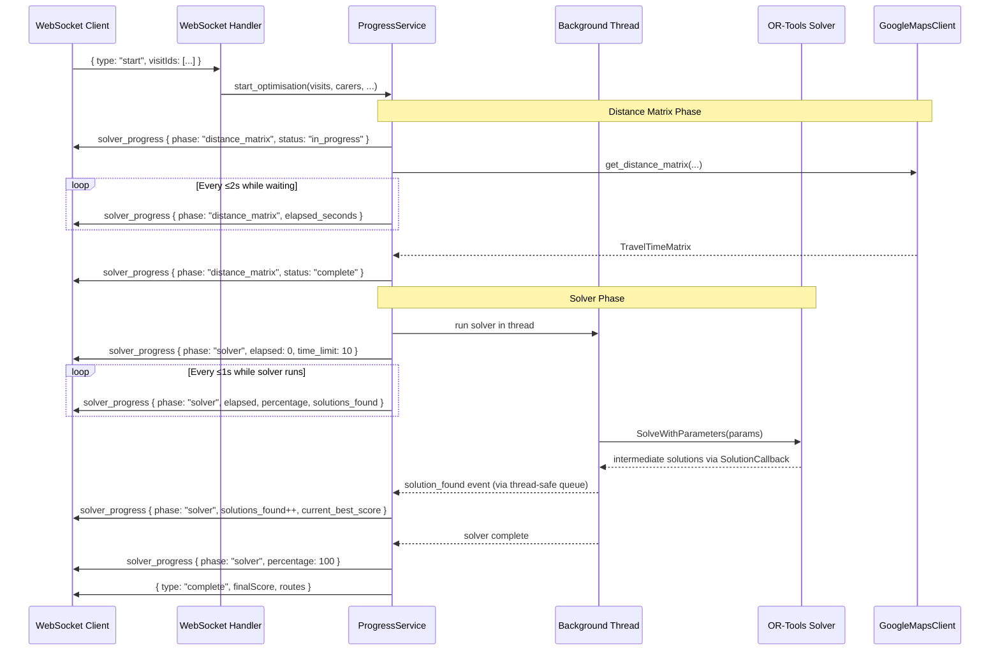

# Design Document: Optimisation Progress Bar

## Overview

This feature adds fine-grained progress reporting to the WinServeCare optimisation pipeline, covering both the Google Maps distance matrix retrieval phase and the OR-Tools solver search phase. The current implementation runs `SolveWithParameters()` synchronously on the async event loop, blocking all WebSocket communication until the solver completes. The new design moves the solver into a background thread and introduces a `ProgressService` that emits structured `solver_progress` WebSocket messages at regular intervals.

Key design goals:
- Non-blocking solver execution via `asyncio.to_thread` / `loop.run_in_executor`
- OR-Tools `CpSolverSolutionCallback` usage to capture intermediate solutions
- Periodic elapsed-time ticks emitted from the async event loop while the solver runs
- Distance matrix phase progress tracking with elapsed time heartbeats
- Full backward compatibility — existing `step` and `progress` messages unchanged

## Architecture



### Threading Model

The OR-Tools `SolveWithParameters()` call is CPU-bound and blocking. The design uses `asyncio.get_event_loop().run_in_executor(None, solver_fn)` to run it in the default thread pool, keeping the async event loop free to:
1. Send periodic progress ticks over WebSocket
2. Receive pause/resume/disconnect messages from the client
3. Process solution callbacks relayed from the solver thread

Communication between the solver thread and the async event loop uses a thread-safe `queue.Queue`. The `SolutionCallback` running inside the solver thread pushes solution events onto the queue. An async task on the event loop polls the queue and emits progress messages.

## Components and Interfaces

### 1. `ProgressService` (new: `backend/app/services/progress.py`)

Central coordinator for progress emission during an optimisation run.

```python
class ProgressService:
    """Manages fine-grained progress reporting for an optimisation session."""

    def __init__(
        self,
        session: OptimisationSession,
        time_limit_seconds: int,
    ) -> None:
        """
        Args:
            session: The WebSocket session to emit messages on.
            time_limit_seconds: Configured solver time limit (clamped to 1-3600).
        """
        ...

    async def start_distance_matrix_phase(self, total_pairs: int) -> None:
        """Begin the distance matrix phase, emit initial solver_progress message."""
        ...

    async def tick_distance_matrix(self, elapsed_seconds: int) -> None:
        """Emit a distance matrix heartbeat with elapsed time."""
        ...

    async def complete_distance_matrix(self, elapsed_seconds: int) -> None:
        """Emit final distance_matrix message with status='complete'."""
        ...

    async def fail_distance_matrix(self, elapsed_seconds: int, error: str) -> None:
        """Emit final distance_matrix message with status='failed'."""
        ...

    async def start_solver_phase(self) -> None:
        """Begin the solver phase, start the elapsed-time ticker task."""
        ...

    async def on_solution_found(self, solutions_found: int, best_score: float) -> None:
        """Called when the solver discovers an improved solution (from queue poll)."""
        ...

    async def complete_solver_phase(self, elapsed_seconds: int, solutions_found: int, best_score: float | None) -> None:
        """Emit final solver progress message with percentage=100."""
        ...

    async def fail_solver_phase(self, elapsed_seconds: int, error: str) -> None:
        """Emit solver phase error and cease further emission."""
        ...

    async def stop(self) -> None:
        """Cancel any running ticker tasks and release resources."""
        ...
```

### 2. `SolverSolutionCallback` (new: inside `backend/app/services/optimiser.py`)

OR-Tools callback that fires on each improved solution during Guided Local Search.

```python
import queue
from dataclasses import dataclass
from ortools.constraint_solver import pywrapcp


@dataclass
class SolutionEvent:
    """Thread-safe event pushed from solver thread to async loop."""
    solutions_found: int
    objective_value: int  # raw OR-Tools objective (cost)
    wall_time_seconds: float


class SolverSolutionCallback(pywrapcp.RoutingModel.SolverCallback):
    """Captures intermediate solutions during OR-Tools search.

    Runs in the solver's background thread. Pushes SolutionEvent objects
    to a thread-safe queue for the async event loop to consume.
    """

    def __init__(self, event_queue: queue.Queue, routing: pywrapcp.RoutingModel) -> None:
        super().__init__()
        self._queue = event_queue
        self._routing = routing
        self._solutions_found = 0
        self._start_time: float = 0.0

    def on_start(self) -> None:
        """Called once when the solver begins search."""
        import time
        self._start_time = time.monotonic()

    def on_solution(self) -> None:
        """Called each time an improved solution is found."""
        import time
        self._solutions_found += 1
        self._queue.put(SolutionEvent(
            solutions_found=self._solutions_found,
            objective_value=self._routing.CostVar().Max(),
            wall_time_seconds=time.monotonic() - self._start_time,
        ))
```

### 3. Modified `OptimisationEngine.run()` 

The existing `run()` method is refactored to:
1. Accept a `ProgressService` instance (or create one internally)
2. Wrap the distance matrix call with progress heartbeats
3. Run `SolveWithParameters()` in a background thread
4. Poll the solution queue in an async loop concurrent with a 1-second ticker

```python
async def run_solver_in_background(
    self,
    model: RoutingModel,
    progress: ProgressService,
) -> pywrapcp.Assignment | None:
    """Run the solver in a thread pool, emitting progress from the event loop."""
    event_queue: queue.Queue[SolutionEvent] = queue.Queue()
    callback = SolverSolutionCallback(event_queue, model.routing)

    # Start solver in background thread
    loop = asyncio.get_event_loop()
    solver_future = loop.run_in_executor(
        None,
        self._solve_blocking,
        model,
        callback,
    )

    # Concurrent progress emission
    await progress.start_solver_phase()
    start_time = time.monotonic()

    while not solver_future.done():
        # Poll solution events from the queue
        while not event_queue.empty():
            event = event_queue.get_nowait()
            await progress.on_solution_found(event.solutions_found, event.objective_value)

        # Emit elapsed-time tick
        elapsed = int(time.monotonic() - start_time)
        await progress.emit_solver_tick(elapsed)

        # Wait up to 1 second (or until solver finishes)
        await asyncio.sleep(min(1.0, 0.1))

    # Drain remaining events
    while not event_queue.empty():
        event = event_queue.get_nowait()
        await progress.on_solution_found(event.solutions_found, event.objective_value)

    return solver_future.result()
```

### 4. Modified `_run_optimisation()` in `websocket.py`

The WebSocket handler creates a `ProgressService` and passes it through the engine. The existing `on_step` and `on_progress` callbacks are preserved unchanged.

### 5. Distance Matrix Progress Wrapper

A helper that wraps the existing `GoogleMapsClient.get_distance_matrix()` call with elapsed-time heartbeats:

```python
async def fetch_matrix_with_progress(
    maps_client: GoogleMapsClient,
    origins: list[Location],
    destinations: list[Location],
    progress: ProgressService,
) -> TravelTimeMatrix:
    """Fetch distance matrix while emitting progress heartbeats."""
    total_pairs = len(origins) * len(destinations)
    await progress.start_distance_matrix_phase(total_pairs)
    start = time.monotonic()

    # Run the matrix fetch as a background task
    fetch_task = asyncio.create_task(
        maps_client.get_distance_matrix(origins=origins, destinations=destinations)
    )

    # Emit heartbeats while waiting
    while not fetch_task.done():
        elapsed = int(time.monotonic() - start)
        await progress.tick_distance_matrix(elapsed)
        await asyncio.sleep(2.0)

    elapsed = int(time.monotonic() - start)
    try:
        result = fetch_task.result()
        await progress.complete_distance_matrix(elapsed)
        return result
    except MapsAPIError as e:
        await progress.fail_distance_matrix(elapsed, str(e.message)[:500])
        raise
```

## Data Models

### WebSocket Message Schema: `solver_progress`

```json
{
  "type": "solver_progress",
  "phase": "solver" | "distance_matrix",
  "elapsed_seconds": <int>,
  
  // Solver phase fields (present when phase == "solver")
  "time_limit_seconds": <int>,        // 1-3600
  "percentage_complete": <float>,      // 0.0-100.0, 1 decimal place
  "solutions_found": <int>,            // >= 0
  "current_best_score": <float|null>,  // null if solutions_found == 0

  // Distance matrix phase fields (present when phase == "distance_matrix")
  "total_pairs": <int>,
  "pairs_completed": <int>,            // 0 to total_pairs
  "status": "in_progress" | "complete" | "failed"
}
```

### Internal Data Structures

```python
@dataclass
class SolutionEvent:
    """Pushed from solver thread to async loop via queue.Queue."""
    solutions_found: int
    objective_value: int
    wall_time_seconds: float


@dataclass
class SolverPhaseState:
    """Tracks solver phase progress on the async side."""
    start_time: float
    time_limit_seconds: int
    solutions_found: int = 0
    current_best_score: float | None = None
    completed: bool = False
    error: str | None = None


@dataclass
class DistanceMatrixPhaseState:
    """Tracks distance matrix phase progress."""
    start_time: float
    total_pairs: int
    pairs_completed: int = 0
    status: str = "in_progress"  # "in_progress" | "complete" | "failed"
    error: str | None = None
```

### Time Limit Clamping

The `time_limit_seconds` value is read from the OR-Tools `search_parameters.time_limit` and clamped:

```python
def _clamp_time_limit(raw_seconds: int) -> tuple[int, bool]:
    """Clamp time limit to valid range [1, 3600]. Returns (clamped_value, was_clamped)."""
    if raw_seconds < 1:
        return 1, True
    if raw_seconds > 3600:
        return 3600, True
    return raw_seconds, False
```

## Correctness Properties

*A property is a characteristic or behavior that should hold true across all valid executions of a system — essentially, a formal statement about what the system should do. Properties serve as the bridge between human-readable specifications and machine-verifiable correctness guarantees.*

### Property 1: Percentage Calculation Invariant

*For any* elapsed_seconds ≥ 0 and time_limit_seconds in [1, 3600], the percentage_complete field SHALL equal min(100, floor(elapsed_seconds / time_limit_seconds × 100)), and when the solver phase completes (regardless of early termination), the final message SHALL have percentage_complete = 100.

**Validates: Requirements 1.3, 1.4**

### Property 2: Solution Event Round-Trip

*For any* sequence of N improved solutions found by the solver (N ≥ 0), the emitted solver_progress messages SHALL contain solutions_found = N and current_best_score matching the objective value of the most recent solution. Each solution callback increments the count by exactly 1.

**Validates: Requirements 2.1, 2.2**

### Property 3: Message Schema Invariant

*For any* emitted message with type "solver_progress": the phase field SHALL be either "distance_matrix" or "solver"; the elapsed_seconds field SHALL be a non-negative integer; when phase is "solver", time_limit_seconds (int, 1-3600), percentage_complete (float, 0.0-100.0), solutions_found (int ≥ 0), and current_best_score (float or null) SHALL be present; when phase is "distance_matrix", total_pairs (int ≥ 1), pairs_completed (int, 0 ≤ x ≤ total_pairs), and status (one of "in_progress", "complete", "failed") SHALL be present.

**Validates: Requirements 4.2, 4.3, 4.4, 4.5**

### Property 4: Phase Ordering

*For any* complete optimisation message stream, all "distance_matrix" phase solver_progress messages SHALL precede all "solver" phase solver_progress messages, and exactly one terminal distance_matrix message (status = "complete" or "failed") SHALL appear before the first solver phase message. No solver phase messages SHALL appear while the distance matrix phase status is "in_progress".

**Validates: Requirements 3.5, 4.6**

### Property 5: Error Description Truncation

*For any* error string of arbitrary length occurring during the distance_matrix phase, the error description in the emitted failure Progress_Message SHALL be at most 500 characters and SHALL be a prefix of the original error string.

**Validates: Requirements 3.4**

### Property 6: Backward-Compatible Stream

*For any* optimisation run producing a message stream, removing all messages where type = "solver_progress" SHALL produce a message sequence identical (in order, type fields, and payload structure) to the stream that would have been produced by the pre-existing protocol without this feature.

**Validates: Requirements 6.2**

### Property 7: Resilience on Progress Failure

*For any* failed solver_progress emission (e.g., serialisation error, closed buffer), the Progress_Service SHALL continue emitting subsequent "step", "progress", and "solver_progress" messages without interruption, and the existing message stream SHALL remain unaffected.

**Validates: Requirements 6.5**

### Property 8: Time Limit Consistency

*For any* time_limit_seconds value configured in OR-Tools search_parameters (within valid range 1-3600), the time_limit_seconds field in the first solver phase Progress_Message SHALL equal that configured value exactly.

**Validates: Requirements 7.2**

### Property 9: Time Limit Clamping

*For any* configured time_limit value outside the valid range [1, 3600], the emitted time_limit_seconds SHALL be clamped to the nearest bound (1 if below, 3600 if above), and the Progress_Message SHALL include a warning indication.

**Validates: Requirements 7.4**

## Error Handling

### Distance Matrix Phase Errors

| Error Condition | Handling |
|----------------|----------|
| MapsAPIError (timeout, invalid key, transport error) | Emit `solver_progress` with `status: "failed"` and error description (truncated to 500 chars). Then emit existing `type: "error"` message. Cease all further progress emission. |
| Partial failure (some pairs unresolvable) | Treat as MapsAPIError — the existing GoogleMapsClient already raises on partial failure. |

### Solver Phase Errors

| Error Condition | Handling |
|----------------|----------|
| Solver raises exception in background thread | Catch in `run_in_executor` result. Emit `solver_progress` with error. Emit existing `type: "error"` message. Release thread resources. |
| Solver returns None (no feasible solution) | Not an error — emit final `solver_progress` with `solutions_found: 0`, `percentage_complete: 100`. Continue with existing no-solution step messages. |
| Thread pool exhausted | Falls through as a RuntimeError. Handled same as solver exception. |

### WebSocket Errors

| Error Condition | Handling |
|----------------|----------|
| Client disconnects during solver phase | `session.disconnected` flag checked before each emission. Solver thread allowed to finish naturally (bounded by time_limit). ProgressService.stop() cancels ticker tasks. |
| solver_progress emission fails (broken pipe, serialisation) | Log warning. Skip that message. Continue emitting subsequent messages. Never propagate to existing message stream. |
| Pause/resume during solver phase | Progress ticker respects `session.paused` Event. Messages queue up during pause, resume on unpause. |

### Time Limit Edge Cases

| Condition | Handling |
|-----------|----------|
| time_limit < 1 | Clamp to 1, include `"warning": "time_limit clamped to minimum 1s"` |
| time_limit > 3600 | Clamp to 3600, include `"warning": "time_limit clamped to maximum 3600s"` |
| time_limit = 0 | Clamp to 1 (prevents division by zero in percentage calculation) |

## Testing Strategy

### Property-Based Tests (using Hypothesis)

Property-based tests validate the correctness properties defined above. Each test runs a minimum of 100 iterations with randomly generated inputs.

**Library**: [Hypothesis](https://hypothesis.readthedocs.io/) (Python PBT library, already compatible with pytest)

**Configuration**: Each property test runs with `@settings(max_examples=100)` minimum.

Tests to implement:
1. **Percentage calculation** — generate random (elapsed, time_limit) pairs, verify formula
2. **Solution event round-trip** — generate random sequences of solution events, verify emitted counts/scores match
3. **Message schema validation** — generate random valid progress states, build messages, verify schema
4. **Phase ordering** — generate random interleaved phase events, verify ordering constraint on output stream
5. **Error truncation** — generate random strings of varying length, verify truncation to 500 chars
6. **Backward-compatible stream** — generate random optimisation runs, verify filter property
7. **Resilience** — generate random failure injection points, verify subsequent messages unaffected
8. **Time limit consistency** — generate random valid time_limits, verify reported value matches
9. **Time limit clamping** — generate random out-of-range values, verify clamping behavior

Tag format: `# Feature: optimisation-progress-bar, Property N: <property_text>`

### Unit Tests (pytest)

- `test_progress_service_init` — verifies initial state after construction
- `test_start_distance_matrix_phase` — verifies first DM message format
- `test_complete_distance_matrix_phase` — verifies terminal DM message
- `test_fail_distance_matrix_phase` — verifies error DM message
- `test_start_solver_phase` — verifies first solver message with time_limit
- `test_complete_solver_phase` — verifies final solver message
- `test_solution_callback_increments` — verifies callback pushes correct events
- `test_no_solution_emits_zero` — edge case: solver completes with 0 solutions
- `test_existing_steps_preserved` — verifies all 8 step messages still emitted
- `test_time_limit_from_config` — verifies dynamic time_limit per run

### Integration Tests (pytest + httpx + WebSocket)

- `test_full_optimisation_with_progress` — end-to-end WebSocket test verifying both step and solver_progress messages appear
- `test_disconnect_during_solver` — client disconnects, verify no resource leaks
- `test_solver_background_thread` — verify event loop remains responsive during solve
- `test_progress_timing` — verify messages arrive within specified intervals
- `test_pause_resume_progress` — verify progress emission respects pause/resume

