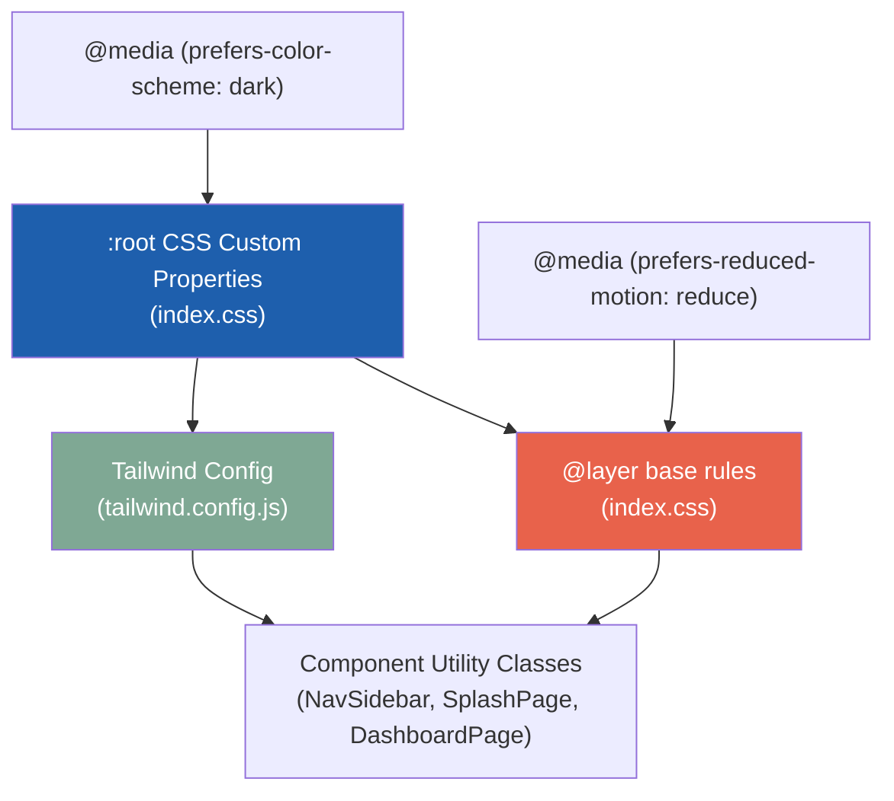

# Design Document: Winserve Care Brand System

## Overview

This design establishes a centralised design-token architecture for the WinServe Care frontend application. Brand values are declared once as CSS custom properties in `index.css`, then surfaced to component code through Tailwind CSS v3.4 theme extensions. This approach decouples visual design from component logic — tokens can be updated in one file and propagate everywhere without touching component code.

The architecture follows a three-layer model:

1. **Token Layer** — CSS custom properties in `:root` (source of truth)
2. **Utility Layer** — Tailwind theme extensions that reference tokens via `var()`
3. **Component Layer** — React components consuming Tailwind utilities

This ensures brand consistency, supports dark mode and reduced motion at the token level, and makes future re-theming straightforward.

## Architecture



**Data flow:**
- CSS custom properties are the canonical token definitions
- `tailwind.config.js` reads tokens via `var()` — Tailwind generates utility classes at build time
- `@layer base` applies document-level defaults (typography, colours, transitions)
- Media queries override tokens and base rules for dark mode and reduced motion
- Components use only Tailwind utility classes — zero inline styles for branded values

## Components and Interfaces

### 1. index.css (Token + Base Layer)

The single CSS file contains three logical sections:

| Section | Purpose |
|---------|---------|
| `:root` block | Declares all design tokens as CSS custom properties |
| `@media (prefers-color-scheme: dark)` | Overrides token values for dark mode |
| `@layer base` | Document defaults: typography scale, body styles, focus states, transitions, reduced motion |

### 2. tailwind.config.js (Utility Layer)

Extends Tailwind's default theme with brand-specific keys:

```typescript
// Pseudo-interface for the theme extension shape
interface TailwindBrandExtension {
  colors: {
    brand: {
      primary: string;   // var(--brand-primary)
      coral: string;     // var(--brand-coral)
      ink: string;       // var(--brand-ink)
      sand: string;      // var(--brand-sand)
      sage: string;      // var(--brand-sage)
      cloud: string;     // var(--brand-cloud)
      mist: string;      // var(--brand-mist)
    }
  };
  fontFamily: {
    display: string[];   // ['Fraunces', 'Georgia', 'serif']
    body: string[];      // ['Inter', 'system-ui', 'sans-serif']
  };
  borderRadius: {
    brand: string;       // '12px'
    'brand-lg': string;  // '16px'
  };
  spacing: {
    block: string;       // '32px'
  };
  transitionDuration: {
    fast: string;        // '200ms'
    normal: string;      // '300ms'
  };
  transitionTimingFunction: {
    brand: string;       // 'var(--ease-brand)'
  };
}
```

### 3. Component Migration Targets

| Component | Current State | Migration |
|-----------|--------------|-----------|
| `NavSidebar.tsx` | Uses `bg-gray-900`, `bg-blue-600`, `text-gray-300` | Replace with `bg-brand-ink`, `bg-brand-primary`, `text-brand-cloud`, etc. |
| `SplashPage.tsx` | Uses inline `style={{ backgroundColor, color, fontFamily }}` | Remove all inline styles, replace with Tailwind brand utilities |
| `DashboardPage.tsx` | Uses `bg-blue-600`, `text-gray-900`, `border-gray-200` | Replace with brand token equivalents |

### 4. Focus State Utility

A single `@layer base` rule targets all interactive elements:

```css
/* Targets: a, button, input, select, textarea, [tabindex]:not([tabindex="-1"]) */
:focus-visible {
  outline: 2px solid var(--brand-primary);
  outline-offset: 2px;
}
```

This eliminates per-component focus styling (e.g., the current `focus:ring-2 focus:ring-blue-600` on SplashPage's button).

## Data Models

### Token Namespace

All CSS custom properties follow the `--brand-*` or `--{category}-{name}` naming convention:

```
Colours:
  --brand-primary:  #1E5FAD  (Trust Blue)
  --brand-coral:    #E8624B  (Warm Coral)
  --brand-ink:      #0F2340  (Deep Ink)
  --brand-sand:     #F6F1EA  (Soft Sand)
  --brand-sage:     #7FA894  (Sage)
  --brand-cloud:    #FFFFFF  (Cloud)
  --brand-mist:     #DDE4EC  (Mist)

Typography:
  --font-display:   'Fraunces', Georgia, serif
  --font-body:      'Inter', system-ui, sans-serif

Spacing & Radii:
  --radius-brand:    12px
  --radius-brand-lg: 16px
  --spacing-block:   32px

Motion:
  --duration-fast:   200ms
  --duration-normal: 300ms
  --ease-brand:      ease-out
```

### Dark Mode Token Overrides

In dark mode, semantic tokens are remapped:

| Token | Light Mode | Dark Mode |
|-------|-----------|-----------|
| `--brand-surface` | `#F6F1EA` (Sand) | `#0F2340` (Ink) |
| `--brand-ink` | `#0F2340` | `#F6F1EA` (Sand) |
| Body background | Sand | Ink |
| Default text | Ink | Sand |

The palette hex values (--brand-primary, --brand-coral, etc.) remain unchanged — only semantic mappings for background/foreground swap.

### Typography Scale

| Element | Font Size | Line Height | Letter Spacing | Weight |
|---------|-----------|-------------|----------------|--------|
| h1 | 3rem (48px) | 1.1 | -0.01em | 500 |
| h2 | 2.25rem (36px) | 1.15 | -0.01em | 500 |
| h3 | 1.5rem (24px) | 1.25 | 0 | 500 |
| h4 | 1.25rem (20px) | 1.3 | 0 | 500 |
| h5 | 1.125rem (18px) | 1.4 | 0 | 500 |
| h6 | 1rem (16px) | 1.5 | 0 | 500 |
| Body | 1rem (16px) | 1.5 | 0 | 400 |
| Labels | 0.875rem (14px) | 1.4 | 0 | 500 |
| Emphasis | — | — | — | 600–700 |

### Contrast Verification (Pre-computed)

| Foreground | Background | Ratio | Passes |
|-----------|-----------|-------|--------|
| Deep Ink (#0F2340) | Soft Sand (#F6F1EA) | ~14.5:1 | AA ✓ |
| Cloud (#FFFFFF) | Trust Blue (#1E5FAD) | ~5.2:1 | AA ✓ |
| Trust Blue (#1E5FAD) | Soft Sand (#F6F1EA) | ~4.2:1 | AA Large ✓, 3:1 focus ✓ |
| Trust Blue (#1E5FAD) | Cloud (#FFFFFF) | ~5.2:1 | AA ✓ |
| Warm Coral (#E8624B) | Soft Sand (#F6F1EA) | ~3.3:1 | Large text only ✓ |
| Soft Sand (#F6F1EA) | Deep Ink (#0F2340) | ~14.5:1 | AA ✓ (dark mode) |
| Trust Blue (#1E5FAD) | Deep Ink (#0F2340) | ~2.8:1 | 3:1 focus — needs verification |

**Design Decision — Dark Mode Focus:** The contrast ratio of Trust Blue (#1E5FAD) against Deep Ink (#0F2340) is approximately 2.8:1 which is below the 3:1 minimum for non-text contrast (focus outlines). In dark mode, the focus outline will use a lightened variant of Trust Blue (`#4A8BD4`, approximately 5:1 against Ink) declared as `--brand-focus-dark`.

## Error Handling

### Build-time Errors

| Scenario | Handling |
|----------|----------|
| Missing CSS custom property reference | Tailwind generates the class with `var(--missing)` — browser falls back to `initial`. The build does NOT fail. Mitigated by smoke tests that verify all tokens exist. |
| Invalid Tailwind config key | Tailwind build fails with a clear error message at `vite build` time. CI catches this. |
| Font not loaded (network failure) | Font stacks include system fallbacks: Georgia for display, system-ui for body. Layout shift mitigated by `font-display: swap` (Google Fonts default). |

### Runtime Graceful Degradation

| Scenario | Handling |
|----------|----------|
| Browser doesn't support CSS custom properties | IE11 only — not in scope. All modern browsers support them. No polyfill needed. |
| `prefers-reduced-motion` not supported | Animations play normally — progressive enhancement, not a failure. |
| `prefers-color-scheme` not supported | Light mode tokens apply — dark mode is an enhancement. |
| Focus-visible not supported (older Safari) | Falls back to `:focus` via the CSS `@supports` fallback or polyfill. For this project, Safari 15.4+ is the minimum (supports :focus-visible natively). |

## Testing Strategy

### Why Property-Based Testing Does Not Apply

This feature is a design-token and styling system. It involves:
- **Configuration declarations** (CSS custom properties, Tailwind config keys) — fixed values, not varying inputs
- **UI rendering** (component class application) — visual output, not pure function I/O
- **Contrast ratio checks** — fixed colour pairs (7 colours × limited pairings), not a large input space

There is no meaningful universal property ("for all X, P(X) holds") where input variation would reveal bugs. The correct testing approach is:

1. **Configuration smoke tests** — verify tokens and Tailwind config structure
2. **Example-based component tests** — verify specific components render correct classes
3. **Visual regression tests** — catch unintended styling changes
4. **Accessibility audits** — contrast ratios and tap target validation

### Test Plan

#### 1. Configuration Smoke Tests (Vitest)

Verify the Tailwind config exports the expected brand extension:

```typescript
// __tests__/tailwind-config.test.ts
import config from '../tailwind.config.js';

describe('Tailwind brand extension', () => {
  it('defines all brand colours with var() references', () => { /* ... */ });
  it('defines fontFamily.display and fontFamily.body', () => { /* ... */ });
  it('defines borderRadius.brand and borderRadius.brand-lg', () => { /* ... */ });
  it('defines spacing.block as 32px', () => { /* ... */ });
  it('defines transitionDuration.fast and transitionDuration.normal', () => { /* ... */ });
  it('defines transitionTimingFunction.brand', () => { /* ... */ });
});
```

#### 2. CSS Token Verification (Vitest + file parsing)

Parse `index.css` and verify `:root` contains all expected custom properties:

```typescript
// __tests__/css-tokens.test.ts
import { readFileSync } from 'fs';

describe('CSS custom properties', () => {
  const css = readFileSync('src/index.css', 'utf-8');
  it('declares all 7 brand colour tokens in :root', () => { /* ... */ });
  it('declares font-display and font-body tokens', () => { /* ... */ });
  it('declares radius and spacing tokens', () => { /* ... */ });
  it('declares motion tokens', () => { /* ... */ });
  it('includes prefers-reduced-motion media query', () => { /* ... */ });
  it('includes prefers-color-scheme dark media query', () => { /* ... */ });
});
```

#### 3. Component Migration Tests (Vitest + React Testing Library)

Verify components render correct brand classes and no legacy generic classes:

```typescript
// __tests__/NavSidebar.test.tsx
describe('NavSidebar brand tokens', () => {
  it('uses bg-brand-ink for sidebar background', () => { /* ... */ });
  it('uses bg-brand-primary for active nav item', () => { /* ... */ });
  it('does not contain bg-gray-900, bg-blue-600, or text-gray-300 classes', () => { /* ... */ });
});

// __tests__/SplashPage.test.tsx  
describe('SplashPage brand tokens', () => {
  it('uses no inline style attributes for colour or fontFamily on non-SVG elements', () => { /* ... */ });
  it('uses bg-brand-sand on root container', () => { /* ... */ });
  it('uses font-display on tagline heading', () => { /* ... */ });
});

// __tests__/DashboardPage.test.tsx
describe('DashboardPage brand tokens', () => {
  it('uses bg-brand-primary for primary action buttons', () => { /* ... */ });
  it('does not contain generic colour utilities (blue-600, gray-900, etc.)', () => { /* ... */ });
});
```

#### 4. Accessibility Contrast Tests (Vitest)

Compute WCAG contrast ratios for fixed colour pairs:

```typescript
// __tests__/contrast.test.ts
import { getContrastRatio } from '../src/test-utils/contrast';

describe('WCAG contrast compliance', () => {
  it('Deep Ink on Soft Sand >= 4.5:1', () => { /* ... */ });
  it('Cloud on Trust Blue >= 4.5:1', () => { /* ... */ });
  it('Trust Blue on Soft Sand >= 3:1 (focus outline)', () => { /* ... */ });
  it('Warm Coral on Soft Sand >= 3:1 (large text only)', () => { /* ... */ });
  it('Soft Sand on Deep Ink >= 4.5:1 (dark mode)', () => { /* ... */ });
  it('Dark mode focus outline >= 3:1 against Deep Ink', () => { /* ... */ });
});
```

#### 5. Visual Regression (Manual / Future CI)

- Screenshot comparison of SplashPage, NavSidebar, and DashboardPage before and after migration
- Recommended tool: Playwright visual comparison or Chromatic (not implemented in this feature scope)

### Test Runner Configuration

- **Framework:** Vitest (already configured in `package.json`)
- **DOM environment:** jsdom (for React Testing Library component tests)
- **Run command:** `npm run test` → `vitest run`
- **Library:** fast-check is available but not needed for this feature
